# Architecture

## Evidence-backed architecture blueprint for the codebase

Skilgen identified 3 top-level architecture domains from 90 evidence items and 13 domain graph nodes. Parser backends in use: empty, python-ast, regex. Source comprehension currently tracks 173 symbol-bearing files, 170 call-bearing files, 72 mapped tests, and 6 workspace packages.

## Visual Overview

```mermaid
graph TD
  requirements["requirements"]
  requirements --> roadmap["roadmap"]
  requirements -. evidence .-> requirements_readme_md["README.md"]
  platform["platform"]
  platform --> requirements["requirements"]
  platform --> roadmap["roadmap"]
  platform -. evidence .-> platform_skilgen_init_py["skilgen/__init__.py"]
  platform -. evidence .-> platform_skilgen_autoupdate_py["skilgen/autoupdate.py"]
  platform -. evidence .-> platform_skilgen_agents_init_py["skilgen/agents/__init__.py"]
  roadmap["roadmap"]
  roadmap --> requirements["requirements"]
  roadmap -. evidence .-> roadmap_skills_roadmap_skill_md["skills/roadmap/SKILL.md"]
  roadmap -. evidence .-> roadmap_report_md["REPORT.md"]
  requirements --> skills_requirements_skill_md["skills/requirements/SKILL.md"]
  skills_requirements_skill_md -. cross-link .-> skills_roadmap_skill_md["skills/roadmap/SKILL.md"]
  platform --> skills_platform_skill_md["skills/platform/SKILL.md"]
  skills_platform_skill_md --> skills_platform_runtime_skill_md["skills/platform/runtime/SKILL.md"]
  skills_platform_skill_md --> skills_platform_agents_skill_md["skills/platform/agents/SKILL.md"]
  skills_platform_skill_md --> skills_platform_cli_skill_md["skills/platform/cli/SKILL.md"]
  skills_platform_skill_md --> skills_platform_core_skill_md["skills/platform/core/SKILL.md"]
  skills_platform_skill_md --> skills_platform_generators_skill_md["skills/platform/generators/SKILL.md"]
  skills_platform_skill_md -. cross-link .-> skills_requirements_skill_md["skills/requirements/SKILL.md"]
  skills_platform_skill_md -. cross-link .-> skills_roadmap_skill_md["skills/roadmap/SKILL.md"]
  roadmap --> skills_roadmap_skill_md["skills/roadmap/SKILL.md"]
  skills_roadmap_skill_md --> skills_roadmap_phase_0_skill_md["skills/roadmap/phase-0/SKILL.md"]
  skills_roadmap_skill_md --> skills_roadmap_phase_1_skill_md["skills/roadmap/phase-1/SKILL.md"]
  skills_roadmap_skill_md --> skills_roadmap_phase_2_skill_md["skills/roadmap/phase-2/SKILL.md"]
  skills_roadmap_skill_md --> skills_roadmap_phase_3_skill_md["skills/roadmap/phase-3/SKILL.md"]
  skills_roadmap_skill_md -. cross-link .-> skills_requirements_skill_md["skills/requirements/SKILL.md"]
  scripts_bump_version_py["scripts/bump_version.py"]
  scripts_bump_version_py --> scripts_bump_version_py_from_future_import_annotations["from __future__ import annotations"]
  scripts_bump_version_py --> scripts_bump_version_py_imports_argparse["imports argparse"]
  scripts_deploy_api_py["scripts/deploy_api.py"]
  scripts_deploy_api_py --> scripts_deploy_api_py_from_future_import_annotations["from __future__ import annotations"]
  scripts_deploy_api_py --> scripts_deploy_api_py_imports_argparse["imports argparse"]
  scripts_deploy_dashboard_py["scripts/deploy_dashboard.py"]
  scripts_deploy_dashboard_py --> scripts_deploy_dashboard_py_from_future_import_annotations["from __future__ import annotations"]
  scripts_deploy_dashboard_py --> scripts_deploy_dashboard_py_imports_argparse["imports argparse"]
  scripts_deploy_web_py["scripts/deploy_web.py"]
  scripts_deploy_web_py --> scripts_deploy_web_py_from_future_import_annotations["from __future__ import annotations"]
  scripts_deploy_web_py --> scripts_deploy_web_py_imports_argparse["imports argparse"]
  scripts_run_requirements_pipeline_py["scripts/run_requirements_pipeline.py"]
  scripts_run_requirements_pipeline_py --> scripts_run_requirements_pipeline_py_from_future_import_annotations["from __future__ import annotations"]
  scripts_run_requirements_pipeline_py --> scripts_run_requirements_pipeline_py_imports_argparse["imports argparse"]
  setup_py["setup.py"]
  setup_py --> setup_py_from_setuptools_import_setup["from setuptools import setup"]
  workspace_apps_dashboard["apps/dashboard"]
  workspace_apps_web["apps/web"]
  workspace_packages_config["packages/config"]
  workspace_packages_db["packages/db"]
  workspace_packages_types["packages/types"]
  workspace_packages_ui["packages/ui"]
  workspace_apps_dashboard -. workspace .-> workspace_packages_config
  workspace_apps_dashboard -. workspace .-> workspace_packages_types
  workspace_apps_dashboard -. workspace .-> workspace_packages_ui
  workspace_apps_web -. workspace .-> workspace_packages_config
  workspace_apps_web -. workspace .-> workspace_packages_types
  workspace_apps_web -. workspace .-> workspace_packages_ui
  workspace_packages_types -. workspace .-> workspace_packages_config
  workspace_packages_ui -. workspace .-> workspace_packages_config
```

## Dominant Languages
- `python`

## Source Comprehension
- Symbol graph files: `173`
- Cross-file symbol relationships: `84`
- Call graph files: `170`
- Config/runtime files: `41`
- Tests mapped to code: `72`
- Runtime artifacts ingested: `1`
- Dependency risk nodes: `264`

## Parser Backends
- `empty`: `3` files
- `python-ast`: `173` files
- `regex`: `3` files

## Workspace Topology
- Repo archetype: `skilgen-platform`
- Workspace tool: `turbo`
- Workspace packages: `6`
- Package dependency edges: `8`

### Example Workspace Packages
- `apps/dashboard` (workspace)
- `apps/web` (app)
- `packages/config` (library)
- `packages/db` (library)
- `packages/types` (library)
- `packages/ui` (library)

### Workspace Package Edges
- `apps/dashboard` -> `packages/config`
- `apps/dashboard` -> `packages/types`
- `apps/dashboard` -> `packages/ui`
- `apps/web` -> `packages/config`
- `apps/web` -> `packages/types`
- `apps/web` -> `packages/ui`
- `packages/types` -> `packages/config`
- `packages/ui` -> `packages/config`

### Example Symbol Surfaces
- `scripts/bump_version.py`: `from __future__ import annotations`, `imports argparse`, `imports re`, `from pathlib import Path`
- `scripts/deploy_api.py`: `from __future__ import annotations`, `imports argparse`, `imports json`, `imports shutil`
- `scripts/deploy_dashboard.py`: `from __future__ import annotations`, `imports argparse`, `imports json`, `imports subprocess`
- `scripts/deploy_web.py`: `from __future__ import annotations`, `imports argparse`, `imports json`, `imports subprocess`
- `scripts/run_requirements_pipeline.py`: `from __future__ import annotations`, `imports argparse`, `imports json`, `from pathlib import Path`
- `setup.py`: `from setuptools import setup`
- `skilgen/__init__.py`: `from skilgen.agents import fingerprint_project`, `from skilgen.autoupdate import auto_update_status, ensure_auto_update_worker, stop_auto_update_worker`, `from skilgen.delivery import run_delivery`, `from skilgen.sdk import activate_project_mcp_connector, activate_skill_source, analyze_project, architecture_project`
- `skilgen/agents/__init__.py`: `from skilgen.agents.codebase_signals import analyze_codebase, collect_code_evidence, collect_structural_evidence`, `from skilgen.agents.architecture_planner import build_architecture_blueprint`, `from skilgen.agents.evidence_graph import build_evidence_graph`, `from skilgen.agents.language_parsers import parse_language_evidence`

### Cross-File Symbol Relationships
- `skilgen/api/jobs.py`: `JobCancelledError` `extends` `RuntimeError` (confidence 0.35)
- `skilgen/api/server.py`: `BoundedThreadPoolHTTPServer` `extends` `HTTPServer` (confidence 0.35)
- `skilgen/api/server.py`: `JsonFormatter` `extends` `logging.Formatter` (confidence 0.35)
- `skilgen/api/server.py`: `SkilgenHandler` `extends` `BaseHTTPRequestHandler` (confidence 0.35)
- `skilgen/commands/check.py`: `CheckConfigError` `extends` `ValueError` (confidence 0.35)
- `skilgen/core/auth_tokens.py`: `SignedTokenError` `extends` `ValueError` (confidence 0.35)
- `skilgen/parsers/__init__.py`: `ApiSpecParserError` `extends` `ValueError` (confidence 0.35)
- `skilgen/parsers/confluence.py`: `_ConfluenceHTMLExtractor` `extends` `HTMLParser` (confidence 0.35)
- `skilgen/parsers/dbt.py`: `DbtProjectParseError` `extends` `ValueError` (confidence 0.35)
- `skilgen/parsers/helm.py`: `HelmParserError` `extends` `ValueError` (confidence 0.35)

### Example Config And Runtime Signals
- `.claude/settings.json`: `env:CLAUDE_TOOL_INPUT_FILE_PATH`, `env:SKILLAYER_API_KEY`, `env:SKILLAYER_REPO_ID`
- `.env.example`: `env:ADMIN_SECRET`, `env:API_URL`, `env:CRON_SECRET`, `env:DATABASE_URL`, `env:DEPLOYMENT_MODE`
- `.github/ISSUE_TEMPLATE/bug_report.yml`: `env:API`, `env:CLI`, `env:SDK`
- `.github/workflows/skilgen-sync.yml`: `env:AGENTS`, `env:ANALYSIS`, `env:ANTHROPIC_API_KEY`, `env:ARCHITECTURE`, `env:BASE_REQUIREMENTS`
- `apps/api/.env.example`: `env:ADMIN_SECRET`, `env:CRON_SECRET`, `env:DATABASE_URL`, `env:DEPLOYMENT_MODE`, `env:GITHUB_APP_ID`
- `apps/api/Dockerfile`: `env:CMD`, `env:COPY`, `env:ENTRYPOINT`, `env:EXPOSE`, `env:FROM`
- `apps/api/alembic.ini`: `env:INFO`, `env:NOT`, `env:NOTSET`, `env:PATH`, `env:POSIX`
- `apps/api/requirements.txt`: `runtime:postgres`, `runtime:redis`

### Runtime Artifact Ingestion
- `tests/fixtures/semgrep_results.sarif` (sast/sarif): SAST findings across 2 files

### Example Test Mapping
- `tests/__init__.py` -> `skilgen/__init__.py`, `skilgen/agents/__init__.py`, `skilgen/api/__init__.py`, `skilgen/cli/__init__.py`
- `tests/test_analytics.py` -> `skilgen/core/analytics.py`
- `tests/test_api_key.py` -> `scripts/deploy_api.py`, `skilgen/api/__init__.py`, `skilgen/api/jobs.py`, `skilgen/api/server.py`
- `tests/test_api_smoke.py` -> `scripts/deploy_api.py`, `skilgen/api/__init__.py`, `skilgen/api/jobs.py`, `skilgen/api/server.py`
- `tests/test_api_spec_parsers.py` -> `scripts/deploy_api.py`, `skilgen/agents/language_parsers.py`, `skilgen/api/__init__.py`, `skilgen/api/jobs.py`
- `tests/test_architecture_cli.py` -> `skilgen/agents/architecture_planner.py`, `skilgen/cli/__init__.py`, `skilgen/cli/main.py`
- `tests/test_architecture_planner.py` -> `skilgen/agents/architecture_planner.py`, `skilgen/agents/decision_planner.py`, `skilgen/agents/domain_graph_planner.py`, `skilgen/agents/roadmap_planner.py`
- `tests/test_audit.py` -> `skilgen/core/audit.py`

### Dependency Risk Signals
- `skilgen/agents/codebase_signals.py`: `fanout:high`, `cycle:internal`
- `skilgen/autoupdate.py`: `fanout:high`, `cycle:internal`
- `skilgen/core/corpus_index.py`: `fanout:high`, `cycle:internal`
- `skilgen/deep_agents_runtime.py`: `fanout:high`, `cycle:internal`
- `skilgen/delivery.py`: `fanout:high`, `cycle:internal`
- `skilgen/generators/package.py`: `fanout:high`, `cycle:internal`
- `manifest:apps/dashboard/package.json`: `fanout:large-manifest`
- `manifest:packages/ui/package.json`: `fanout:large-manifest`

## Skill Materialization Plan
### requirements
- Decision: `keep`
- Parent skill: `skills/requirements/SKILL.md`
- Cross-links:
  - `skills/roadmap/SKILL.md`
- Rationale: Keep as a first-class boundary because confidence is 0.99, 1 evidence paths cluster around one coherent responsibility set, and the boundary is clearer as a single skill than as shallower splits.

### platform
- Decision: `split`
- Parent skill: `skills/platform/SKILL.md`
- Child skills:
  - `skills/platform/runtime/SKILL.md`
  - `skills/platform/agents/SKILL.md`
  - `skills/platform/cli/SKILL.md`
  - `skills/platform/core/SKILL.md`
  - `skills/platform/generators/SKILL.md`
  - `skills/platform/scripts/SKILL.md`
- Cross-links:
  - `skills/requirements/SKILL.md`
  - `skills/roadmap/SKILL.md`
- Rationale: Split because 6 concrete child skill surfaces emerged from 6 grounded evidence paths. The parent skill can hold shared context while child skills isolate the distinct capability seams around platform-runtime, platform-agents, platform-cli.

### roadmap
- Decision: `split`
- Parent skill: `skills/roadmap/SKILL.md`
- Child skills:
  - `skills/roadmap/phase-0/SKILL.md`
  - `skills/roadmap/phase-1/SKILL.md`
  - `skills/roadmap/phase-2/SKILL.md`
  - `skills/roadmap/phase-3/SKILL.md`
- Cross-links:
  - `skills/requirements/SKILL.md`
- Rationale: Split because 4 concrete child skill surfaces emerged from 2 grounded evidence paths. The parent skill can hold shared context while child skills isolate the distinct capability seams around roadmap-phase-0, roadmap-phase-1, roadmap-phase-2.

## Architecture Domains
### requirements
- Confidence: `0.99`
- Summary: Planning and product-intent domain used to keep the skill tree aligned with requirements and changing scope.
- Responsibilities:
  - Planning and product-intent domain used to keep the skill tree aligned with requirements and changing scope.
  - requirements-first planning
  - skill scaffolding
- Evidence paths:
  - `README.md`
- Related domains: `roadmap`
- Recommended skill path: `skills/requirements/SKILL.md`

### platform
- Confidence: `0.90`
- Summary: Tooling and runtime domain covering Skilgen's internal engine, CLI, planners, generators, and maintenance scripts.
- Responsibilities:
  - Tooling and runtime domain covering Skilgen's internal engine, CLI, planners, generators, and maintenance scripts.
  - Coordinates subdomains: platform-runtime, platform-agents, platform-cli, platform-core.
  - tooling platform
  - generation engine
- Evidence paths:
  - `skilgen/__init__.py`
  - `skilgen/autoupdate.py`
  - `skilgen/agents/__init__.py`
  - `skilgen/agents/architecture_planner.py`
  - `skilgen/cli/__init__.py`
  - `skilgen/cli/main.py`
- Related domains: `requirements`, `roadmap`
- Recommended skill path: `skills/platform/SKILL.md`

### roadmap
- Confidence: `0.84`
- Summary: Delivery sequencing domain that keeps phases, next steps, and implementation order explicit for agents.
- Responsibilities:
  - Delivery sequencing domain that keeps phases, next steps, and implementation order explicit for agents.
  - Coordinates subdomains: roadmap-phase-0, roadmap-phase-1, roadmap-phase-2, roadmap-phase-3.
  - phase-based delivery
  - sequenced implementation planning
- Evidence paths:
  - `skills/roadmap/SKILL.md`
  - `REPORT.md`
- Related domains: `requirements`
- Recommended skill path: `skills/roadmap/SKILL.md`

## Evidence Graph Recommendations
- Use high-signal source evidence to define domain boundaries before generating skills.
- Prefer domains that are supported by both code evidence and requirements intent.
- Optimize skill synthesis around the dominant languages: python.
- Use structural evidence such as functions, classes, divisions, and sections to refine skill boundaries.
- Use the symbol graph to align skill boundaries with real modules, classes, and callable surfaces.
- Parser backends in use: empty, python-ast, regex.
- Keep skill guidance grounded in both implementation evidence and the nearest mapped tests.
- Model package boundaries from the `turbo` workspace graph separately from file-level import edges.

## Hotspots
- Dominant languages: python.
