# Architecture

## Evidence-backed architecture blueprint for the codebase

Skilgen identified 2 top-level architecture domains from 38 evidence items and 12 domain graph nodes. Parser backends in use: empty, python-ast, regex. Source comprehension currently tracks 101 symbol-bearing files, 98 call-bearing files, 43 mapped tests, and 0 workspace packages.

## Visual Overview

```mermaid
graph TD
  platform["platform"]
  platform --> roadmap["roadmap"]
  platform -. evidence .-> platform_skilgen_init_py["skilgen/__init__.py"]
  platform -. evidence .-> platform_skilgen_autoupdate_py["skilgen/autoupdate.py"]
  platform -. evidence .-> platform_skilgen_agents_init_py["skilgen/agents/__init__.py"]
  roadmap["roadmap"]
  roadmap --> requirements["requirements"]
  roadmap --> backend["backend"]
  roadmap --> frontend["frontend"]
  roadmap -. evidence .-> roadmap_skills_roadmap_skill_md["skills/roadmap/SKILL.md"]
  roadmap -. evidence .-> roadmap_report_md["REPORT.md"]
  platform --> skills_platform_skill_md["skills/platform/SKILL.md"]
  skills_platform_skill_md --> skills_platform_runtime_skill_md["skills/platform/runtime/SKILL.md"]
  skills_platform_skill_md --> skills_platform_agents_skill_md["skills/platform/agents/SKILL.md"]
  skills_platform_skill_md --> skills_platform_cli_skill_md["skills/platform/cli/SKILL.md"]
  skills_platform_skill_md --> skills_platform_core_skill_md["skills/platform/core/SKILL.md"]
  skills_platform_skill_md --> skills_platform_generators_skill_md["skills/platform/generators/SKILL.md"]
  skills_platform_skill_md -. cross-link .-> skills_roadmap_skill_md["skills/roadmap/SKILL.md"]
  roadmap --> skills_roadmap_skill_md["skills/roadmap/SKILL.md"]
  skills_roadmap_skill_md --> skills_roadmap_phase_0_skill_md["skills/roadmap/phase-0/SKILL.md"]
  skills_roadmap_skill_md --> skills_roadmap_phase_1_skill_md["skills/roadmap/phase-1/SKILL.md"]
  skills_roadmap_skill_md --> skills_roadmap_phase_2_skill_md["skills/roadmap/phase-2/SKILL.md"]
  skills_roadmap_skill_md --> skills_roadmap_phase_3_skill_md["skills/roadmap/phase-3/SKILL.md"]
  scripts_bump_version_py["scripts/bump_version.py"]
  scripts_bump_version_py --> scripts_bump_version_py_from_future_import_annotations["from __future__ import annotations"]
  scripts_bump_version_py --> scripts_bump_version_py_imports_argparse["imports argparse"]
  scripts_run_requirements_pipeline_py["scripts/run_requirements_pipeline.py"]
  scripts_run_requirements_pipeline_py --> scripts_run_requirements_pipeline_py_from_future_import_annotations["from __future__ import annotations"]
  scripts_run_requirements_pipeline_py --> scripts_run_requirements_pipeline_py_imports_argparse["imports argparse"]
  setup_py["setup.py"]
  setup_py --> setup_py_from_setuptools_import_setup["from setuptools import setup"]
  skilgen_init_py["skilgen/__init__.py"]
  skilgen_init_py --> skilgen_init_py_from_skilgen_agents_import_fingerprint_project["from skilgen.agents import fingerprint_project"]
  skilgen_init_py --> skilgen_init_py_from_skilgen_autoupdate_import_auto_update_status_ensure_auto_update_worker_stop_auto_update_worker["from skilgen.autoupdate import auto_update_status, ensure_auto_update_worker, stop_auto_update_worker"]
  skilgen_agents_init_py["skilgen/agents/__init__.py"]
  skilgen_agents_init_py --> skilgen_agents_init_py_from_skilgen_agents_codebase_signals_import_analyze_codebase_collect_code_evidence_collect_structural_evidence["from skilgen.agents.codebase_signals import analyze_codebase, collect_code_evidence, collect_structural_evidence"]
  skilgen_agents_init_py --> skilgen_agents_init_py_from_skilgen_agents_architecture_planner_import_build_architecture_blueprint["from skilgen.agents.architecture_planner import build_architecture_blueprint"]
  skilgen_agents_architecture_planner_py["skilgen/agents/architecture_planner.py"]
  skilgen_agents_architecture_planner_py --> skilgen_agents_architecture_planner_py_from_future_import_annotations["from __future__ import annotations"]
  skilgen_agents_architecture_planner_py --> skilgen_agents_architecture_planner_py_from_dataclasses_import_asdict["from dataclasses import asdict"]
```

## Dominant Languages
- `python`

## Source Comprehension
- Symbol graph files: `101`
- Cross-file symbol relationships: `49`
- Call graph files: `98`
- Config/runtime files: `6`
- Tests mapped to code: `43`
- Runtime artifacts ingested: `0`
- Dependency risk nodes: `119`

## Parser Backends
- `empty`: `3` files
- `python-ast`: `101` files
- `regex`: `1` files

## Workspace Topology
- Repo archetype: `skilgen-platform`
- Workspace tool: `none`
- Workspace packages: `0`
- Package dependency edges: `0`

### Example Workspace Packages
- No first-class workspace graph detected.

### Workspace Package Edges
- No internal package dependency edges were extracted.

### Example Symbol Surfaces
- `scripts/bump_version.py`: `from __future__ import annotations`, `imports argparse`, `imports re`, `from pathlib import Path`
- `scripts/run_requirements_pipeline.py`: `from __future__ import annotations`, `imports argparse`, `imports json`, `from pathlib import Path`
- `setup.py`: `from setuptools import setup`
- `skilgen/__init__.py`: `from skilgen.agents import fingerprint_project`, `from skilgen.autoupdate import auto_update_status, ensure_auto_update_worker, stop_auto_update_worker`, `from skilgen.delivery import run_delivery`, `from skilgen.sdk import activate_project_mcp_connector, activate_skill_source, analyze_project, architecture_project`
- `skilgen/agents/__init__.py`: `from skilgen.agents.codebase_signals import analyze_codebase, collect_code_evidence, collect_structural_evidence`, `from skilgen.agents.architecture_planner import build_architecture_blueprint`, `from skilgen.agents.evidence_graph import build_evidence_graph`, `from skilgen.agents.language_parsers import parse_language_evidence`
- `skilgen/agents/architecture_planner.py`: `from __future__ import annotations`, `from dataclasses import asdict`, `from pathlib import Path`, `from skilgen.agents.domain_graph_planner import build_domain_graph`
- `skilgen/agents/codebase_signals.py`: `from __future__ import annotations`, `imports ast`, `from functools import lru_cache`, `imports re`
- `skilgen/agents/decision_planner.py`: `from __future__ import annotations`, `from pathlib import Path`, `from skilgen.deep_agents_core import run_deep_json`, `from skilgen.core.freshness import compute_freshness_report, load_freshness_state`

### Cross-File Symbol Relationships
- `skilgen/api/jobs.py`: `JobCancelledError` `extends` `RuntimeError` (confidence 0.35)
- `skilgen/api/server.py`: `BoundedThreadPoolHTTPServer` `extends` `HTTPServer` (confidence 0.35)
- `skilgen/api/server.py`: `JsonFormatter` `extends` `logging.Formatter` (confidence 0.35)
- `skilgen/api/server.py`: `SkilgenHandler` `extends` `BaseHTTPRequestHandler` (confidence 0.35)
- `skilgen/core/auth_tokens.py`: `SignedTokenError` `extends` `ValueError` (confidence 0.35)
- `tests/oidc_test_utils.py`: `Handler` `extends` `BaseHTTPRequestHandler` (confidence 0.35)
- `tests/test_analytics.py`: `AnalyticsTests` `extends` `unittest.TestCase` (confidence 0.35)
- `tests/test_api_smoke.py`: `ApiSmokeTests` `extends` `unittest.TestCase` (confidence 0.35)
- `tests/test_architecture_cli.py`: `ArchitectureCliTests` `extends` `unittest.TestCase` (confidence 0.35)
- `tests/test_architecture_planner.py`: `ArchitecturePlannerTests` `extends` `unittest.TestCase` (confidence 0.35)

### Example Config And Runtime Signals
- `.github/ISSUE_TEMPLATE/bug_report.yml`: `env:API`, `env:CLI`, `env:SDK`
- `.github/workflows/skilgen-sync.yml`: `env:AGENTS`, `env:ANALYSIS`, `env:ANTHROPIC_API_KEY`, `env:ARCHITECTURE`, `env:BASE_REQUIREMENTS`
- `docs/examples/librechat-skill-tree/skilgen.yml`: `env:ANTHROPIC_API_KEY`, `env:AZURE_OPENAI_API_KEY`, `env:GOOGLE_API_KEY`, `env:HUGGINGFACEHUB_API_TOKEN`, `env:IAM`
- `examples/github-actions/skilgen-sync.yml`: `env:AGENTS`, `env:ANALYSIS`, `env:ANTHROPIC_API_KEY`, `env:ARCHITECTURE`, `env:FEATURES`
- `pyproject.toml`: `env:LICENSE`, `env:MIT`, `env:OSI`, `env:README`
- `skilgen.yml`: `env:OPENAI_API_KEY`

### Runtime Artifact Ingestion
- No coverage reports, test result artifacts, SARIF outputs, or trace payloads were detected.

### Example Test Mapping
- `tests/__init__.py` -> `skilgen/__init__.py`, `skilgen/agents/__init__.py`, `skilgen/api/__init__.py`, `skilgen/cli/__init__.py`
- `tests/test_analytics.py` -> `skilgen/core/analytics.py`
- `tests/test_api_smoke.py` -> `skilgen/api/__init__.py`, `skilgen/api/jobs.py`, `skilgen/api/server.py`, `skilgen/api/service.py`
- `tests/test_architecture_cli.py` -> `skilgen/agents/architecture_planner.py`, `skilgen/cli/__init__.py`, `skilgen/cli/main.py`
- `tests/test_architecture_planner.py` -> `skilgen/agents/architecture_planner.py`, `skilgen/agents/decision_planner.py`, `skilgen/agents/domain_graph_planner.py`, `skilgen/agents/roadmap_planner.py`
- `tests/test_audit.py` -> `skilgen/core/audit.py`
- `tests/test_auth_claim_mapping.py` -> `skilgen/core/auth_tokens.py`
- `tests/test_auth_tokens.py` -> `skilgen/core/auth_tokens.py`

### Dependency Risk Signals
- `skilgen/agents/codebase_signals.py`: `fanout:high`, `cycle:internal`
- `skilgen/autoupdate.py`: `fanout:high`, `cycle:internal`
- `skilgen/core/corpus_index.py`: `fanout:high`, `cycle:internal`
- `skilgen/deep_agents_runtime.py`: `fanout:high`, `cycle:internal`
- `skilgen/delivery.py`: `fanout:high`, `cycle:internal`
- `skilgen/generators/package.py`: `fanout:high`, `cycle:internal`
- `package:PyYAML`: `version:loosely-pinned`
- `package:beautifulsoup4`: `version:loosely-pinned`

## Skill Materialization Plan
### platform
- Decision: `split`
- Parent skill: `skills/platform/SKILL.md`
- Child skills:
  - `skills/platform/runtime/SKILL.md`
  - `skills/platform/agents/SKILL.md`
  - `skills/platform/cli/SKILL.md`
  - `skills/platform/core/SKILL.md`
  - `skills/platform/generators/SKILL.md`
  - `skills/platform/scripts/SKILL.md`
- Cross-links:
  - `skills/roadmap/SKILL.md`
- Rationale: Split because 6 concrete child skill surfaces emerged from 6 grounded evidence paths. The parent skill can hold shared context while child skills isolate the distinct capability seams around platform-runtime, platform-agents, platform-cli.

### roadmap
- Decision: `split`
- Parent skill: `skills/roadmap/SKILL.md`
- Child skills:
  - `skills/roadmap/phase-0/SKILL.md`
  - `skills/roadmap/phase-1/SKILL.md`
  - `skills/roadmap/phase-2/SKILL.md`
  - `skills/roadmap/phase-3/SKILL.md`
- Rationale: Split because 4 concrete child skill surfaces emerged from 2 grounded evidence paths. The parent skill can hold shared context while child skills isolate the distinct capability seams around roadmap-phase-0, roadmap-phase-1, roadmap-phase-2.

## Architecture Domains
### platform
- Confidence: `0.90`
- Summary: Tooling and runtime domain covering Skilgen's internal engine, CLI, planners, generators, and maintenance scripts.
- Responsibilities:
  - Tooling and runtime domain covering Skilgen's internal engine, CLI, planners, generators, and maintenance scripts.
  - Coordinates subdomains: platform-runtime, platform-agents, platform-cli, platform-core.
  - tooling platform
  - generation engine
- Evidence paths:
  - `skilgen/__init__.py`
  - `skilgen/autoupdate.py`
  - `skilgen/agents/__init__.py`
  - `skilgen/agents/architecture_planner.py`
  - `skilgen/cli/__init__.py`
  - `skilgen/cli/main.py`
- Related domains: `roadmap`
- Recommended skill path: `skills/platform/SKILL.md`

### roadmap
- Confidence: `0.84`
- Summary: Delivery sequencing domain that keeps phases, next steps, and implementation order explicit for agents.
- Responsibilities:
  - Delivery sequencing domain that keeps phases, next steps, and implementation order explicit for agents.
  - Coordinates subdomains: roadmap-phase-0, roadmap-phase-1, roadmap-phase-2, roadmap-phase-3.
  - phase-based delivery
  - sequenced implementation planning
- Evidence paths:
  - `skills/roadmap/SKILL.md`
  - `REPORT.md`
- Related domains: `requirements`, `backend`, `frontend`
- Recommended skill path: `skills/roadmap/SKILL.md`

## Evidence Graph Recommendations
- Use high-signal source evidence to define domain boundaries before generating skills.
- Prefer domains that are supported by both code evidence and requirements intent.
- Optimize skill synthesis around the dominant languages: python.
- Use structural evidence such as functions, classes, divisions, and sections to refine skill boundaries.
- Use the symbol graph to align skill boundaries with real modules, classes, and callable surfaces.
- Parser backends in use: empty, python-ast, regex.
- Keep skill guidance grounded in both implementation evidence and the nearest mapped tests.
- Use cross-file symbol relationships to keep inheritance and interface seams aligned with the skill tree.

## Hotspots
- Dominant languages: python.
