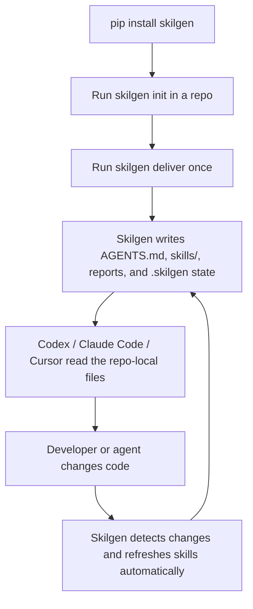
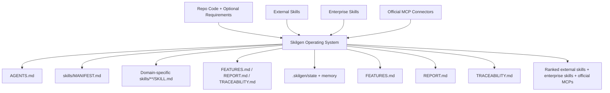

<p align="center">
  
</p>

<h1 align="center">Skilgen</h1>

<p align="center">
  Give coding agents a living skill system that stays current as your repo changes.
</p>

<p align="center">
  <a href="https://pypi.org/project/skilgen/"></a>
  <a href="https://pypi.org/project/skilgen/"></a>
  <a href="https://github.com/skilgen/skilgen/actions/workflows/ci.yml"></a>
  <a href="LICENSE"></a>
</p>

<p align="center">
  Skilgen reads your codebase, builds the right skills and agent docs, keeps them updated automatically, and layers in trusted external, enterprise, and official MCP capabilities so Codex, Claude Code, Cursor, and other agents can work with real context instead of guesswork.
</p>

## Quick Start

Install Skilgen:

```bash
python -m pip install skilgen
```

Choose a model provider and export its API key:

```bash
export OPENAI_API_KEY="your_openai_key"
```

```bash
export ANTHROPIC_API_KEY="your_anthropic_key"
```

```bash
export HUGGINGFACEHUB_API_TOKEN="your_huggingface_token"
```

Go to your repo and initialize it:

```bash
cd your-repo
skilgen init --project-root .
```

If you want provider-specific starter config:

```bash
skilgen init --project-root . --provider openai
skilgen init --project-root . --provider anthropic
skilgen init --project-root . --provider huggingface
```

Generate the repo-local skill system:

```bash
skilgen deliver --project-root .
```

Check what Skilgen is doing:

```bash
skilgen status --project-root .
skilgen decide --project-root .
skilgen doctor --project-root .
```

That is the core experience:
1. install Skilgen
2. export your provider key
3. run it in a repo
4. let it create `AGENTS.md`, `skills/`, reports, and `.skilgen/` state
5. keep coding while Skilgen keeps the skill system current

## Quick Start Flow



## What The Generated Skill System Looks Like

This is the shape Skilgen creates for a real repo after `skilgen deliver`.



From a real OpenAI-backed run, Skilgen generated:
- `AGENTS.md` with inferred domains, start order, external skill packs, policy, and decision memory
- a dynamic `skills/` tree based on the actual repo shape and inferred domains
- domain-specific `skills/**/SKILL.md` files for whatever the codebase needs
- `FEATURES.md`, `REPORT.md`, and `TRACEABILITY.md`
- `.skilgen/` state and memory for continuity and refresh decisions

Depending on the repo, those generated domains might include backend, frontend, data, platform, design-system, operations, roadmap, or other repo-specific areas inferred by Skilgen.

Example of what the generated `AGENTS.md` contains:

| Section | What the agent learns |
| --- | --- |
| Project Overview | whether the run came from code, requirements, or both |
| Inferred Domains | backend, frontend, roadmap, and other detected domains |
| Skill Entry Points | exactly which `SKILL.md` files to read first |
| External Skill Packs | which trusted external skills were installed |
| Preferred External Skill Packs | which packs to load first and why |
| Enterprise Skill Packs | which company-wide skills are active |
| MCP Connectors | which approved official connectors are active |
| Recommended Start Order | the exact loading order for skills and memory |
| Execution Rules | the repo-specific operating contract for the agent |

In practice, that means the agent does not guess.
Skilgen gives it a real operating system built from the repo, then keeps that system updated dynamically.

## Skilgen As The Agent Operating System

Skilgen is the operating layer that prepares your repo for AI coding agents and keeps that context fresh.

Instead of asking agents to rediscover your architecture, patterns, tools, and standards every session, Skilgen:
- builds the right project skills from your code, requirements, or both
- generates the docs agents actually need to work well
- watches for repo changes and refreshes skills automatically
- brings in external and enterprise skill packs when they matter
- connects agents to approved official MCP capabilities safely

That means agents do not have to manage their own skills manually.
Skilgen handles that system for them.

## How It Fits With Codex And Claude Code

Skilgen is not a replacement for `~/.codex`.

Instead, Skilgen prepares the **repository itself** so Codex, Claude Code, Cursor, and similar agents can work with the right local context.

There are two layers:

- `~/.codex`
  - your global Codex home, personal defaults, and Codex-specific setup
- `your-repo/AGENTS.md`, `your-repo/skills/`, and `your-repo/.skilgen/`
  - the repo-local skill system that Skilgen generates and keeps updated

So the workflow is simple:
1. install Skilgen in your Python environment
2. run it inside a repository
3. let Skilgen generate and refresh repo-local skills and docs
4. let your coding agent use those repo-local files while it works

## Core Capabilities

- generates project-native skills from code, requirements, or both
- builds `AGENTS.md`, `FEATURES.md`, `REPORT.md`, and `TRACEABILITY.md`
- tracks freshness, memory, and agent load order automatically
- keeps skills current automatically as Codex, Claude Code, Cursor, or humans change the repo
- imports external skill ecosystems from one place
- ingests enterprise-wide skills from internal repos, docs, and runbooks
- discovers official MCP connectors from repo signals
- auto-activates only MCP connectors that pass official-source and OAuth policy checks
- gives Codex, Claude Code, and similar agents one unified operating context

## What It Does

Skilgen turns your repo into a self-maintaining skills system for coding agents.

It reads your codebase, your requirements, or both, then generates the context, memory, reusable skills, and approved capability layer that agents need to work well immediately.

In one pass, Skilgen can:
- understand the real shape of your repo
- infer domains, boundaries, and implementation patterns
- generate `AGENTS.md`, `FEATURES.md`, `REPORT.md`, and `TRACEABILITY.md`
- generate a reusable `skills/` tree for backend, frontend, roadmap, and dynamically inferred domains
- decide when skills should refresh and what an agent should load first
- keep those skills refreshed automatically after setup
- discover, install, rank, and manage external skill ecosystems through one interface
- ingest enterprise-wide skill packs and recommend MCP connectors for real operating systems like Jira, Confluence, Slack, Datadog, Sentry, and Kubernetes

## Why It Matters

Most AI workflows break down because context gets stale fast.

Skilgen keeps that context reusable and current.

It gives agents:
- project-specific guidance instead of generic prompting
- stable memory and refresh signals instead of stale assumptions
- stronger execution patterns instead of ad-hoc improvisation
- a one-stop shop for generated repo skills, external skills, enterprise skills, and official MCP connectors

That means agents do not just work faster. They work with better judgment, safer tooling, and less manual setup.

## At A Glance

| You Have | Skilgen Produces | Why It Helps |
| --- | --- | --- |
| Existing codebase | domain graph, skills, reports, agent contract | agents understand the actual repo before changing it |
| Requirements document | feature intent, roadmap, starter skills | agents can plan before implementation exists |
| Codebase + requirements | highest-fidelity operating context | agents align shipped behavior with planned scope |
| External skill ecosystems | installable, rankable, managed skill packs | agents can pull in trusted skills from one place |
| Enterprise skills + MCP tools | approved skills and official connectors | agents can work inside enterprise boundaries without unsafe guesswork |

## What You Get Fast

- repo-local agent context that Codex and Claude Code can use immediately
- automatic skill upkeep after installation
- `AGENTS.md` for the top-level agent contract
- `FEATURES.md` for product behavior
- `REPORT.md` for project-level understanding
- `TRACEABILITY.md` for source-to-output reasoning
- `skills/MANIFEST.md` and `skills/**/SKILL.md` for execution-ready guidance
- `.skilgen/state/` and `.skilgen/memory/` for freshness and continuity

## What Skilgen Handles Automatically

Skilgen is designed so that a coding agent does not need to figure the environment out from scratch.

Once installed and initialized, Skilgen can automatically:
- inspect the repo and infer the right project skill structure
- detect external skill ecosystems that fit the repo
- ingest configured enterprise skill packs from `skilgen.yml`
- recommend MCP connectors from real repo evidence
- auto-activate only connectors that are both officially sourced and OAuth-ready when policy allows
- keep watching the repo in the background so changed code triggers a refresh without a manual `deliver`
- surface the final operating context in `AGENTS.md`, `REPORT.md`, and `TRACEABILITY.md`

For most teams, the desired experience is:

1. install Skilgen
2. run `skilgen init`
3. keep coding
4. let Skilgen keep agent skills up to date

## Quick Mental Model

- Skilgen reads your project
- Skilgen materializes the right skills, docs, and capability context
- Skilgen keeps that context fresh as the repo changes
- agents load those skills instead of guessing
- external ecosystems can also be installed and managed through Skilgen
- enterprise skills and approved MCP connectors can be layered in alongside repo-native skills

## Enterprise Skills And MCP Connectors

Skilgen can now do three things at once:

- generate project-native skills from your repo and requirements
- ingest enterprise-wide skills that already exist in shared repos, runbooks, or internal docs
- recommend and activate approved MCP connectors so coding agents can operate through enterprise systems safely

That means Codex, Claude Code, and similar agents can start with:
- repo-specific implementation context
- organization-wide standards and playbooks
- approved tool access for systems like Jira, Confluence, Slack, Datadog, Sentry, GitHub Enterprise, Kubernetes, Terraform, Snowflake, Postgres, and Okta

MCP connectors in Skilgen are now treated as enterprise integrations, not loose suggestions. Each connector carries:
- an official source URL when Skilgen has a vendor-backed MCP reference
- an auth scheme, with OAuth2 required by default for enterprise-ready activation
- security guidance around least-privilege scopes, consent boundaries, and token rotation

If a connector does not have a verified official source or does not meet the repo's OAuth policy, Skilgen will not auto-activate it.

### Official MCPs Skilgen Can Manage

Skilgen can now catalog and reason about official MCP sources such as:
- Atlassian: Jira, Confluence, Compass
- Slack
- GitHub Enterprise
- GitLab
- Azure and Azure Kubernetes
- Terraform
- MongoDB
- Notion
- Microsoft Learn
- Stripe
- Figma
- Elasticsearch
- Sentry
- Chrome DevTools
- Playwright

Skilgen also tracks enterprise-relevant connectors like SharePoint, Snowflake, Postgres, and generic Kubernetes sources, but marks them separately when an official MCP source has not been verified yet.

That means Skilgen does more than list connectors. It tells the agent:
- which connectors are official
- which connectors are only community-tracked
- which ones satisfy enterprise OAuth policy
- which ones are safe to activate automatically

### Common Enterprise Flows

| Goal | Command | Outcome |
| --- | --- | --- |
| Ingest an existing enterprise skill pack | `skilgen enterprise ingest --project-root . --name platform-engineering --path ./internal-skills/platform` | Adds a reusable enterprise skill into `.skilgen/enterprise-skills/` |
| Generate an enterprise skill from runbooks or docs | `skilgen enterprise generate --project-root . --name incident-response --source-path ./runbooks/incident.md --kind runbook` | Creates a new enterprise skill pack from internal source material |
| See which enterprise connectors fit the repo | `skilgen connectors recommend --project-root .` | Suggests MCP connectors based on repo signals and config policy |
| Activate an approved connector | `skilgen connectors activate jira --project-root .` | Marks the connector active so agents can use it as approved capability context |

### Configuring Enterprise Sources

Add shared enterprise skill locations directly to `skilgen.yml` so normal `deliver` runs can ingest them automatically:

```yaml
enterprise_skill_paths:
  - ./internal-skills/platform
  - ./runbooks/shared-guidance
enterprise_skill_git_urls:
  - git@github.company.com:ai/platform-skills.git
auto_activate_mcp_connectors: true
mcp_connectors_require_official_source: true
mcp_connectors_require_oauth: true
mcp_connector_allowlist:
  - jira
  - confluence
  - kubernetes
```

When these are configured, `skilgen deliver` will:
- ingest configured enterprise skills
- recommend MCP connectors from repo evidence
- activate only connectors that satisfy the official-source and OAuth policy gates
- surface all of that in `AGENTS.md`, `REPORT.md`, and `TRACEABILITY.md`

## What Skilgen Understands

Skilgen can work from:
- an existing codebase
- a requirements document such as a PRD
- both together when you want implementation-aware planning

From those inputs, Skilgen synthesizes:
- feature intent
- entities and domain boundaries
- backend endpoints and service areas
- frontend flows and component zones
- roadmap phases
- dynamic domain graphs inferred from the real repo
- freshness signals for when skills should refresh
- in-flight run memory for agent continuity
- reusable skill guidance for agents

## What You Get

Generated outputs can include:
- `AGENTS.md`
- `ANALYSIS.md`
- `FEATURES.md`
- `REPORT.md`
- `TRACEABILITY.md`
- `skills/MANIFEST.md`
- `skills/GRAPH.md`
- dynamic top-level and child `skills/**`
- `.skilgen/state/freshness.json`
- `.skilgen/memory/current_run.json`
- `.skilgen/memory/runs/<run_id>.json`

This gives your agents:
- a stable memory layer
- reusable execution guidance
- project-specific context instead of generic prompting
- refresh decisions grounded in actual repo change signals
- a better path toward consistent, high-quality, engineering-standard delivery

## Quick Start

Install Skilgen from source:

```bash
python -m pip install .
```

Install Skilgen from PyPI:

```bash
python -m pip install skilgen
```

Requirements:
- Python 3.11+
- The model-backed runtime requires Python 3.11+

Runtime behavior:
- If you configure a supported model provider and API key, Skilgen uses the full model-backed runtime.
- If you do not provide an API key, Skilgen falls back to local deterministic analysis.
- The fallback mode still works, but it is less intelligent and less complete than the full model-backed runtime.

Initialize config in your repo:

```bash
skilgen init --project-root .
```

`skilgen init` now writes a provider-neutral `skilgen.yml` by default, so it does not assume OpenAI unless you explicitly want that.

It also enables repo-local auto-update by default. After `init`, Skilgen can keep skills fresh in the background as code changes land in the repo.

If you want provider-specific starter values:

```bash
skilgen init --project-root . --provider openai
skilgen init --project-root . --provider anthropic
skilgen init --project-root . --provider gemini
skilgen init --project-root . --provider huggingface
```

Check the background auto-update worker:

```bash
skilgen autoupdate status --project-root .
skilgen autoupdate disable --project-root .
skilgen autoupdate enable --project-root .
```

Analyze a codebase:

```bash
skilgen fingerprint --project-root .
```

Diagnose runtime readiness:

```bash
skilgen doctor --project-root .
```

Decide whether skills should refresh and what an agent should load first:

```bash
skilgen decide --project-root .
```

Generate docs and skills from just the codebase:

```bash
skilgen deliver --project-root .
```

Interpret a requirements document:

```bash
skilgen intent --requirements docs/product-requirements.docx
```

Build a feature model from the repo and requirements:

```bash
skilgen features --requirements docs/product-requirements.docx --project-root .
```

Build a roadmap:

```bash
skilgen plan --requirements docs/product-requirements.docx --project-root .
```

Discover consolidated external skill ecosystems through Skilgen:

```bash
skilgen skills list
skilgen skills detect --project-root .
skilgen skills show anthropic-skills
```

Install a curated or custom external skill source into the local Skilgen-managed registry:

```bash
skilgen skills install anthropic-skills --project-root .
skilgen skills active --project-root .
skilgen skills lock --project-root .
skilgen skills lock-export --project-root .
skilgen skills lock-import --project-root ./another-repo --input-path ./.skilgen/external-skills/export-lock.json
skilgen skills policy --project-root .
skilgen skills rank --project-root .
skilgen skills import awesome-agent-skills-voltagent --project-root . --limit 5
skilgen skills sync anthropic-skills --project-root .
skilgen skills remove anthropic-skills --project-root .
skilgen skills install --git-url https://github.com/example/skills.git --name my-skill-pack --project-root .
```

Manage enterprise-wide skills and MCP connectors through Skilgen:

```bash
skilgen enterprise list --project-root .
skilgen enterprise ingest --project-root . --name platform-engineering --path ./internal-skills/platform
skilgen enterprise generate --project-root . --name oncall-playbook --source-path ./runbooks/oncall.md --kind runbook
skilgen connectors list --search jira
skilgen connectors recommend --project-root .
skilgen connectors active --project-root .
skilgen connectors activate jira --project-root .
skilgen connectors deactivate jira --project-root .
```

When Skilgen runs on an existing repository, it also looks for strong ecosystem hints such as:
- `CLAUDE.md` or `.claude/`
- LangChain, LangGraph, Deep Agents, or LangSmith dependencies
- Hugging Face package usage
- GitHub Copilot instructions
- n8n workflow patterns
- existing `SKILL.md` / `skills/` structures

If a strong match is found, Skilgen auto-installs the matching external skill pack into `.skilgen/external-skills/` so coding agents can use it immediately.
Installed packs are tracked with:
- `manifest.json` for installed sources
- `lock.json` for resolved revisions, active/inactive state, and normalized entrypoint indexes
- `normalized/<slug>/` for Skilgen-friendly adapter summaries

Normalized adapter summaries now include:
- grouped entrypoints by ecosystem
- detected README title/summary
- detected license metadata
- downstream GitHub repo candidates for awesome-list and directory sources
- ecosystem-native views such as Anthropic skill families, LangChain/LangSmith families, and Hugging Face task families

Skilgen also ranks active packs by:
- repo detection signals
- trust level
- ecosystem fit
- normalized entrypoint depth

Portable lockfiles and bulk import:
- `skilgen skills lock-export` captures the exact external-skill setup for reuse in another repo
- `skilgen skills lock-import` restores that setup, including active state
- `skilgen skills import <directory-slug>` converts downstream directory candidates into first-class Skilgen-managed installs

Policy modes:
- `permissive`: use trust/allowlist/denylist as configured
- `official_only`: only official/spec catalog sources can auto-install
- `review_required`: matching packs can auto-install but stay inactive until you activate them explicitly

## Supported External Skills

Skilgen can act as a one-stop shop for skill ecosystems by exposing them through the same interface:

```bash
skilgen skills list
skilgen skills detect --project-root .
skilgen skills show <slug>
skilgen skills install <slug> --project-root .
skilgen skills activate <slug> --project-root .
skilgen skills deactivate <slug> --project-root .
skilgen skills active --project-root .
skilgen skills lock --project-root .
skilgen skills lock-export --project-root .
skilgen skills lock-import --project-root . --input-path ./external-skills-lock.json
skilgen skills policy --project-root .
skilgen skills rank --project-root .
skilgen skills import <directory-slug> --project-root . --limit 5
skilgen skills sync <slug> --project-root .
skilgen skills sync --all --project-root .
skilgen skills remove <slug> --project-root .
```

| Publisher | Source | Category | Trust | Auto Install | Best For | Install |
| --- | --- | --- | --- | --- | --- | --- |
| Anthropic | `anthropic-skills` | Official | Official | Yes | Claude Code skills and templates | `skilgen skills install anthropic-skills --project-root .` |
| LangChain AI | `langchain-skills` | Official | Official | Yes | LangChain, LangGraph, Deep Agents | `skilgen skills install langchain-skills --project-root .` |
| LangChain AI | `langsmith-skills` | Official | Official | Yes | LangSmith evaluation and tracing skills | `skilgen skills install langsmith-skills --project-root .` |
| Hugging Face | `huggingface-skills` | Official | Official | Yes | HF hub, datasets, jobs, trainers | `skilgen skills install huggingface-skills --project-root .` |
| Hugging Face | `huggingface-upskill` | Official | Official | Yes | Skill generation and benchmarking | `skilgen skills install huggingface-upskill --project-root .` |
| GitHub / Microsoft | `awesome-copilot` | Official | Official | Yes | GitHub Copilot workflow skills | `skilgen skills install awesome-copilot --project-root .` |
| agentskills.io | `agentskills-spec` | Spec | Spec | Yes | SKILL.md format reference | `skilgen skills install agentskills-spec --project-root .` |
| czlonkowski | `n8n-mcp-patterns` | Framework | Community | Yes | n8n MCP and workflow patterns | `skilgen skills install n8n-mcp-patterns --project-root .` |
| Orchestra Research | `ai-research-skills` | Framework | Community | Yes | Research, RAG, CrewAI, LlamaIndex | `skilgen skills install ai-research-skills --project-root .` |
| muratcankoylan | `context-engineering-skills` | Framework | Community | Yes | Context engineering and multi-agent patterns | `skilgen skills install context-engineering-skills --project-root .` |
| yusufkaraaslan | `skill-seekers` | Tooling | Community | Manual | Converting docs/sites/repos into SKILL.md | `skilgen skills install skill-seekers --project-root .` |
| VoltAgent | `awesome-agent-skills-voltagent` | Directory | Directory | Manual | Broad cross-ecosystem discovery | `skilgen skills install awesome-agent-skills-voltagent --project-root .` |
| skillmatic-ai | `awesome-agent-skills-skillmatic` | Directory | Directory | Manual | Aggregated skill guides and links | `skilgen skills install awesome-agent-skills-skillmatic --project-root .` |
| heilcheng | `awesome-agent-skills-heilcheng` | Directory | Directory | Manual | Claude, Codex, Copilot-oriented directories | `skilgen skills install awesome-agent-skills-heilcheng --project-root .` |
| Prat011 | `awesome-llm-skills` | Directory | Directory | Manual | Workspace and multi-agent skill lists | `skilgen skills install awesome-llm-skills --project-root .` |
| MoizIbnYousaf | `curated-ai-agent-skills` | Curated | Curated | Manual | Trust-aware curated skill packs | `skilgen skills install curated-ai-agent-skills --project-root .` |
| LangChain AI | `skills-benchmarks` | Benchmarks | Official | Manual | Skill quality and benchmarking flows | `skilgen skills install skills-benchmarks --project-root .` |

Generate the full skills system from codebase + requirements:

```bash
skilgen deliver --requirements docs/product-requirements.docx --project-root .
```

## Progress Feedback

Skilgen explains long-running work in plain English while it runs.

CLI example:

```text
[skilgen] Starting delivery with the model_backed runtime. This may take a bit while Skilgen builds project context and generates the final skill tree.
[skilgen] Reading your codebase and requirements and loading the Skilgen project configuration.
[skilgen] Building project context so agents can understand the repo structure and delivery scope.
[skilgen] Inspecting the codebase to identify frameworks, domains, and implementation patterns.
[skilgen] Generating project docs so coding agents have clear context, traceability, and operating guidance.
[skilgen] Materializing backend, frontend, requirements, and roadmap skills for coding agents.
[skilgen] Finished delivery. Generated or refreshed 24 files.
```

API example:

```json
{
  "api_version": "1.0",
  "runtime": "model_backed",
  "runtime_diagnostics": {
    "provider": "openai",
    "model": "gpt-4.1-mini",
    "api_key_present": true
  },
  "events": [
    {"message": "Reading your codebase and requirements and loading the Skilgen project configuration."},
    {"message": "Building project context so agents can understand the repo structure and delivery scope."},
    {"message": "Generating project docs so coding agents have clear context, traceability, and operating guidance."}
  ],
  "generated_files": [
    "AGENTS.md",
    "FEATURES.md",
    "skills/MANIFEST.md"
  ]
}
```

Background jobs expose the same style of progress through job status:
- `progress` for a simple numeric indicator
- `message` for the current step
- `events` for the history of user-facing updates

Feature synthesis example:

```text
[skilgen] Starting feature synthesis with the model_backed runtime. Skilgen is reading the project context to identify the capabilities that matter.
[skilgen] Reading the codebase and optional requirements to identify product capabilities.
[skilgen] Grouping detected backend, frontend, and planning signals into a reusable feature inventory.
```

Roadmap planning example:

```text
[skilgen] Starting roadmap planning with the model_backed runtime. Skilgen is turning project context into a staged implementation plan.
[skilgen] Reading project scope and available inputs for roadmap planning.
[skilgen] Synthesizing implementation phases and sequencing the next delivery steps.
```

## Core Commands

- `skilgen init` writes a default `skilgen.yml`
- `skilgen doctor` explains runtime readiness, provider setup, and missing credentials
- `skilgen fingerprint` detects the likely stack of the current codebase
- `skilgen intent` interprets a requirements document into structured intent
- `skilgen features` builds a feature inventory from a codebase, requirements, or both
- `skilgen plan` generates a roadmap view from a codebase, requirements, or both
- `skilgen decide` tells agents whether to refresh skills, which domains to prioritize, and which memory files to load
- `skilgen skills` lists, inspects, installs, syncs, and removes external skill ecosystems through a single Skilgen interface
- `skilgen scan` generates docs and skills from the codebase and optionally a requirements file
- `skilgen deliver` runs the main generation flow with or without a requirements file

## Example Output

```text
.
├── AGENTS.md
├── ANALYSIS.md
├── FEATURES.md
├── REPORT.md
├── TRACEABILITY.md
├── .skilgen
│   ├── state
│   │   └── freshness.json
│   └── memory
│       ├── current_run.json
│       └── runs
│           └── <run_id>.json
├── skilgen.yml
└── skills
    ├── MANIFEST.md
    ├── GRAPH.md
    ├── requirements
    ├── roadmap
    ├── ...dynamically generated domain families
    └── ...additional inferred child skills
```

## First-Class Examples

- `examples/codebase-only/README.md`: minimal repo scan without a requirements document
- `examples/requirements-only/README.md`: requirements-driven generation from a spec alone
- `examples/codebase-and-requirements/README.md`: combined high-fidelity generation flow
- `examples/external-skills/README.md`: install, import, rank, and portable-lock workflows for external skills

## Model Configuration

Skilgen reads runtime settings from `skilgen.yml`.

```yaml
include_paths:
  - .
exclude_paths:
  - .git
  - __pycache__
  - .venv
  - node_modules
domains_override:
skill_depth: 2
update_trigger: manual
langsmith_project:
# Set these to your preferred provider. For example:
# openai / gpt-4.1-mini / OPENAI_API_KEY
# anthropic / claude-sonnet-4-5 / ANTHROPIC_API_KEY
# gemini / gemini-2.5-pro / GOOGLE_API_KEY
# huggingface / meta-llama/Llama-3.1-70B-Instruct / HUGGINGFACEHUB_API_TOKEN
model_provider:
model:
api_key_env:
model_temperature:
model_max_tokens:
model_retry_attempts: 3
model_retry_base_delay_seconds: 1.0
```

Supported `model_provider` values:
- `openai`
- `anthropic`
- `gemini`
- `google`
- `google_genai`
- `huggingface`
- `hugging_face`
- `hf`

Default API key environment mapping:
- `openai` -> `OPENAI_API_KEY`
- `anthropic` -> `ANTHROPIC_API_KEY`
- `gemini` / `google_genai` -> `GOOGLE_API_KEY`
- `huggingface` -> `HUGGINGFACEHUB_API_TOKEN`

Important:
- Without a valid provider API key, Skilgen will not use LLMs.
- In that case, it runs in local fallback mode for analysis and generation.
- Local fallback mode is faster, but it does not have the same reasoning depth or synthesis quality as the full model-backed path.
- Skilgen retries transient provider failures such as rate limits, timeouts, and temporary upstream outages.
- Use `model_retry_attempts` and `model_retry_base_delay_seconds` when you want to tune model-backed resilience.

Example Anthropic config:

```yaml
model_provider: anthropic
model: claude-sonnet-4-5
api_key_env: ANTHROPIC_API_KEY
model_temperature: 0.1
model_max_tokens: 4096
```

Example Gemini config:

```yaml
model_provider: gemini
model: gemini-2.5-pro
api_key_env: GOOGLE_API_KEY
```

Example Hugging Face config:

```yaml
model_provider: huggingface
model: meta-llama/Llama-3.1-70B-Instruct
api_key_env: HUGGINGFACEHUB_API_TOKEN
```

## How It Works

1. Read the codebase, the requirements source, or both.
2. Interpret product intent and implementation shape.
3. Infer a dynamic domain graph and choose the right skill topology.
4. Build feature, roadmap, traceability, and agent guidance.
5. Persist freshness state and in-flight run memory.
6. Generate project docs and materialize a reusable `skills/` tree.

That means the same repo can become:
- planning context for humans
- execution guidance for agents
- a project memory layer that evolves with the codebase
- a freshness-aware system that knows when skills should be refreshed
- a quality layer that helps agents choose stronger patterns and produce better code

## Best For

- AI-first developer tools
- fast-moving startup repos
- greenfield products starting from a PRD
- existing codebases that need better agent context
- teams that want reusable backend, frontend, and roadmap guidance in one place

## Status

- OpenAI has been tested live in this repo
- Anthropic, Gemini, and Hugging Face are wired through config and dependencies
- provider-aware error handling is built in for auth failures, rate limits, missing models, and transient upstream issues
- use `--project-root` to point Skilgen at any codebase
- `--requirements` is optional for `features`, `plan`, `scan`, and `deliver`
- `decide` uses freshness, run memory, and the inferred domain graph to guide the next agent step
- skill families can now expand beyond the original fixed seed taxonomy when the repo structure demands it
- replace `docs/product-requirements.docx` with your own requirements path when you want requirements-aware generation
- Skilgen now persists `.skilgen/state/` and `.skilgen/memory/` to support selective refresh and continuity
- run `skilgen doctor --project-root .` when you want to verify provider setup before a model-backed run
- for full model-backed quality, set a supported provider API key before running Skilgen

## Contributing

- Open a bug report or feature request with the issue templates in `.github/ISSUE_TEMPLATE/`
- Use pull requests for all changes to `main`
- Run `python -m unittest discover -s tests` before opening a PR
- If backend behavior changes, test every affected endpoint on both happy and failure paths
- See `CHANGELOG.md` for release history and upcoming release notes
