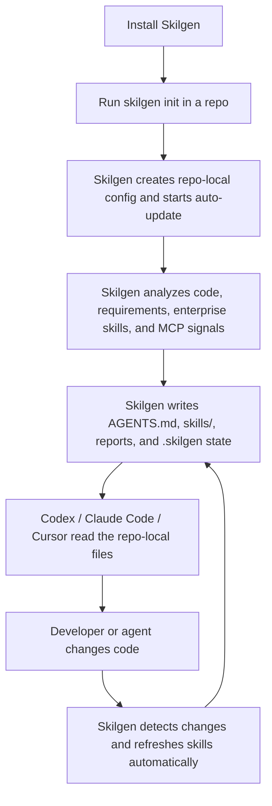

<p align="center">
  
</p>

<h1 align="center">Skilgen</h1>

<p align="center">
  Install Skilgen once, run it in your repo, and let it keep your agent skills, docs, enterprise context, and approved MCP connectors up to date automatically.
</p>

<p align="center">
  <a href="https://pypi.org/project/skilgen/"></a>
  <a href="https://pypi.org/project/skilgen/"></a>
  <a href="https://github.com/skilgen/skilgen/actions/workflows/ci.yml"></a>
  <a href="LICENSE"></a>
</p>

<p align="center">
  Skilgen is the repo-local skill system for Codex, Claude Code, Cursor, and other coding agents. It generates and refreshes the files agents actually need inside the repository they are working on.
</p>

## Quick Start

Install Skilgen from PyPI:

```bash
python -m pip install skilgen
```

Export a provider key if you want the full model-backed runtime:

```bash
export OPENAI_API_KEY="your_key_here"
# or
export ANTHROPIC_API_KEY="your_key_here"
# or
export HUGGINGFACEHUB_API_TOKEN="your_token_here"
```

Initialize the repo and let Skilgen start its repo-local skill system:

```bash
skilgen init --project-root .
skilgen deliver --project-root .
skilgen status --project-root .
```

That’s the whole idea:
1. install Skilgen
2. run it once in a repo
3. let Skilgen keep the repo-local agent context fresh as code changes

## What Skilgen Does

Skilgen turns your repository into an agent-ready operating system that stays current as the code changes.

When you run Skilgen in a repo, it can:
- generate and refresh `AGENTS.md`, `FEATURES.md`, `REPORT.md`, and `TRACEABILITY.md`
- generate and refresh a project `skills/` tree
- detect changed code and refresh skills automatically
- score the quality of the skill tree with a verifiable `Skilgen Score`
- ingest enterprise-wide skill packs
- install and rank external skill ecosystems
- recommend and activate approved official MCP connectors
- decide what an agent should load first before it starts working

## Why Teams Use It

Most AI coding sessions fail for the same reasons:
- the agent starts without the real repo context
- guidance gets stale after code changes
- enterprise knowledge is scattered across docs, runbooks, and tribal memory
- tool access is not governed or consistent

Skilgen fixes that by giving the repo a living skill system instead of a one-time prompt.

## Skilgen Score

Skilgen Score is the quality bar for a skill tree.

It is a `0-100` score with four `0-25` subscores:

| Subscore | What It Measures | What A High Score Means |
| --- | --- | --- |
| Groundedness | How much the skill system points to real files, paths, and repo evidence | skills are specific to the codebase, not generic advice |
| Coverage | How much of the real codebase is mapped into skill domains | major repo areas are represented in the skill tree |
| Freshness | Whether skills are current relative to current code and saved freshness state | the skill system is up to date |
| Structure | Whether the repo has the right artifacts, cross-links, and traceability | the skill tree is complete, navigable, and valid |

Run it like this:

```bash
skilgen score --project-root .
```

Skilgen Score is intentionally opinionated:
- stale skills cap the score
- weak grounding caps the score
- weak coverage caps the score
- missing `AGENTS.md`, `TRACEABILITY.md`, `MANIFEST.md`, or `GRAPH.md` caps the score

That means a high score signals real quality, not just lots of generated files.

## What Agents Get Immediately

Skilgen prepares the files that coding agents actually need inside the repository:
- `AGENTS.md`
- `skills/`
- `FEATURES.md`
- `REPORT.md`
- `TRACEABILITY.md`
- `.skilgen/` state and memory

That gives agents:
- repo-specific instructions instead of repeated prompting
- freshness-aware context instead of stale assumptions
- ranked external and enterprise skills when they matter
- approved MCP capability context when enterprise tools are available

## How It Works

Skilgen is a Python package you install in your environment.

Codex or Claude Code do **not** need Skilgen inside `~/.codex` to use it.

Instead, Skilgen prepares the **repository itself** so the agent can read:
- `AGENTS.md`
- `skills/`
- `FEATURES.md`
- `REPORT.md`
- `TRACEABILITY.md`
- `.skilgen/` state and memory

Think of the layers like this:

- `~/.codex`
  - your global Codex home, personal defaults, and Codex-specific setup
- `your-repo/AGENTS.md` and `your-repo/skills/`
  - the repo-local operating context that Skilgen creates and keeps fresh

That means the workflow is:
1. install Skilgen
2. run it inside a repo
3. let Skilgen generate and update the repo-local skill system
4. let Codex, Claude Code, or Cursor use that repo-local context while coding

## Quick Flow



## Feature Highlights

| Capability | What Skilgen Does |
| --- | --- |
| Repo-native skill system | Generates `AGENTS.md`, `skills/`, and supporting docs directly inside the repo |
| Automatic upkeep | Detects code changes and refreshes skills without repeated manual runs |
| Quality standard | Computes a `Skilgen Score` that grades the health of the skill tree |
| Project understanding | Builds domain graphs, reports, feature maps, and refresh priorities |
| Enterprise skills | Ingests and manages organization-wide skill packs |
| External skills | Installs, ranks, activates, and syncs public skill ecosystems |
| Official MCP handling | Recommends and activates approved official OAuth-ready MCP connectors |
| Agent decision support | Tells agents what to load first and what context matters most |
| Reproducibility | Tracks state, memory, provenance, trust, and lockfile-backed skill setups |

## Why It Matters

Most AI workflows lose time on re-explaining context.

Skilgen makes that context reusable.

It gives agents:
- project-specific guidance instead of generic prompting
- stable memory and refresh signals instead of stale assumptions
- stronger execution patterns instead of ad-hoc improvisation
- a one-stop shop for both generated repo skills and external skill ecosystems

That means agents do not just work faster. They work with better judgment.

## At A Glance

| You Have | Skilgen Produces | Why It Helps |
| --- | --- | --- |
| Existing codebase | domain graph, skills, reports, agent contract | agents understand the actual repo before changing it |
| Requirements document | feature intent, roadmap, starter skills | agents can plan before implementation exists |
| Codebase + requirements | highest-fidelity operating context | agents align shipped behavior with planned scope |
| External skill ecosystems | installable, rankable, managed skill packs | agents can pull in trusted skills from one place |

## What Skilgen Handles Automatically

Once initialized in a repo, Skilgen can automatically:
- detect repository changes and refresh skills
- preserve existing `skilgen.yml` config instead of overwriting it
- keep repo-local agent context current for Codex, Claude Code, and Cursor
- detect ecosystem signals such as LangChain, Anthropic, Hugging Face, and more
- ingest configured enterprise skill packs
- recommend official MCP connectors from repo evidence
- auto-activate only connectors that pass enterprise policy checks such as official-source and OAuth requirements
- keep freshness, memory, and status state under `.skilgen/`

## What You Get Fast

- `AGENTS.md` for the top-level agent contract
- `FEATURES.md` for product behavior
- `REPORT.md` for project-level understanding
- `TRACEABILITY.md` for source-to-output reasoning
- `skills/MANIFEST.md` and `skills/**/SKILL.md` for execution-ready guidance
- `.skilgen/state/` and `.skilgen/memory/` for freshness and continuity

## Quick Mental Model

- Skilgen reads your project
- Skilgen materializes the right skills and docs
- agents load those skills instead of guessing
- external ecosystems can also be installed and managed through Skilgen

## What A Great Score Looks Like

- `90+`
  - excellent
  - skills are grounded, current, complete, and structurally healthy
- `75-89`
  - strong
  - the repo has a solid skill system with a few remaining gaps
- `60-74`
  - fair
  - usable, but one or more quality gates are holding it back
- `<60`
  - needs work
  - the skill system is either stale, weakly grounded, incomplete, or under-mapped

The goal is not just to generate more files.
The goal is to keep a high-confidence, high-quality skill system that agents can trust.

## What Skilgen Understands

Skilgen can work from:
- an existing codebase
- a requirements document such as a PRD
- both together when you want implementation-aware planning

From those inputs, Skilgen synthesizes:
- feature intent
- entities and domain boundaries
- backend endpoints and service areas
- frontend flows and component zones
- roadmap phases
- dynamic domain graphs inferred from the real repo
- freshness signals for when skills should refresh
- in-flight run memory for agent continuity
- reusable skill guidance for agents

## What You Get

Generated outputs can include:
- `AGENTS.md`
- `ANALYSIS.md`
- `FEATURES.md`
- `REPORT.md`
- `TRACEABILITY.md`
- `skills/MANIFEST.md`
- `skills/GRAPH.md`
- dynamic top-level and child `skills/**`
- `.skilgen/state/freshness.json`
- `.skilgen/memory/current_run.json`
- `.skilgen/memory/runs/<run_id>.json`

This gives your agents:
- a stable memory layer
- reusable execution guidance
- project-specific context instead of generic prompting
- refresh decisions grounded in actual repo change signals
- a better path toward consistent, high-quality, engineering-standard delivery

## Installation Options

Install Skilgen from source:

```bash
python -m pip install .
```

Requirements:
- Python 3.11+
- The model-backed runtime requires Python 3.11+

Runtime behavior:
- If you configure a supported model provider and API key, Skilgen uses the full model-backed runtime.
- If you do not provide an API key, Skilgen falls back to local deterministic analysis.
- The fallback mode still works, but it is less intelligent and less complete than the full model-backed runtime.

Initialize config in your repo:

```bash
skilgen init --project-root .
```

`skilgen init` now writes a provider-neutral `skilgen.yml` by default, so it does not assume OpenAI unless you explicitly want that.

If you want provider-specific starter values:

```bash
skilgen init --project-root . --provider openai
skilgen init --project-root . --provider anthropic
skilgen init --project-root . --provider gemini
skilgen init --project-root . --provider huggingface
```

Analyze a codebase:

```bash
skilgen fingerprint --project-root .
```

Diagnose runtime readiness:

```bash
skilgen doctor --project-root .
```

Decide whether skills should refresh and what an agent should load first:

```bash
skilgen decide --project-root .
```

Generate docs and skills from just the codebase:

```bash
skilgen deliver --project-root .
```

Interpret a requirements document:

```bash
skilgen intent --requirements docs/product-requirements.docx
```

Build a feature model from the repo and requirements:

```bash
skilgen features --requirements docs/product-requirements.docx --project-root .
```

Build a roadmap:

```bash
skilgen plan --requirements docs/product-requirements.docx --project-root .
```

Generate the full skills system from codebase + requirements:

```bash
skilgen deliver --requirements docs/product-requirements.docx --project-root .
```

## Progress Feedback

Skilgen explains long-running work in plain English while it runs.

CLI example:

```text
[skilgen] Starting delivery with the model_backed runtime. This may take a bit while Skilgen builds project context and generates the final skill tree.
[skilgen] Reading your codebase and requirements and loading the Skilgen project configuration.
[skilgen] Building project context so agents can understand the repo structure and delivery scope.
[skilgen] Inspecting the codebase to identify frameworks, domains, and implementation patterns.
[skilgen] Generating project docs so coding agents have clear context, traceability, and operating guidance.
[skilgen] Materializing backend, frontend, requirements, and roadmap skills for coding agents.
[skilgen] Finished delivery. Generated or refreshed 24 files.
```

API example:

```json
{
  "api_version": "1.0",
  "runtime": "model_backed",
  "runtime_diagnostics": {
    "provider": "openai",
    "model": "gpt-4.1-mini",
    "api_key_present": true
  },
  "events": [
    {"message": "Reading your codebase and requirements and loading the Skilgen project configuration."},
    {"message": "Building project context so agents can understand the repo structure and delivery scope."},
    {"message": "Generating project docs so coding agents have clear context, traceability, and operating guidance."}
  ],
  "generated_files": [
    "AGENTS.md",
    "FEATURES.md",
    "skills/MANIFEST.md"
  ]
}
```

Background jobs expose the same style of progress through job status:
- `progress` for a simple numeric indicator
- `message` for the current step
- `events` for the history of user-facing updates

Feature synthesis example:

```text
[skilgen] Starting feature synthesis with the model_backed runtime. Skilgen is reading the project context to identify the capabilities that matter.
[skilgen] Reading the codebase and optional requirements to identify product capabilities.
[skilgen] Grouping detected backend, frontend, and planning signals into a reusable feature inventory.
```

Roadmap planning example:

```text
[skilgen] Starting roadmap planning with the model_backed runtime. Skilgen is turning project context into a staged implementation plan.
[skilgen] Reading project scope and available inputs for roadmap planning.
[skilgen] Synthesizing implementation phases and sequencing the next delivery steps.
```

## Core Commands

- `skilgen init` writes a default `skilgen.yml`
- `skilgen doctor` explains runtime readiness, provider setup, and missing credentials
- `skilgen fingerprint` detects the likely stack of the current codebase
- `skilgen intent` interprets a requirements document into structured intent
- `skilgen features` builds a feature inventory from a codebase, requirements, or both
- `skilgen plan` generates a roadmap view from a codebase, requirements, or both
- `skilgen decide` tells agents whether to refresh skills, which domains to prioritize, and which memory files to load
- `skilgen scan` generates docs and skills from the codebase and optionally a requirements file
- `skilgen deliver` runs the main generation flow with or without a requirements file

## Example Output

```text
.
├── AGENTS.md
├── ANALYSIS.md
├── FEATURES.md
├── REPORT.md
├── TRACEABILITY.md
├── .skilgen
│   ├── state
│   │   └── freshness.json
│   └── memory
│       ├── current_run.json
│       └── runs
│           └── <run_id>.json
├── skilgen.yml
└── skills
    ├── MANIFEST.md
    ├── GRAPH.md
    ├── requirements
    ├── roadmap
    ├── ...dynamically generated domain families
    └── ...additional inferred child skills
```

## First-Class Examples

- `examples/codebase-only/README.md`: minimal repo scan without a requirements document
- `examples/requirements-only/README.md`: requirements-driven generation from a spec alone
- `examples/codebase-and-requirements/README.md`: combined high-fidelity generation flow

## Model Configuration

Skilgen reads runtime settings from `skilgen.yml`.

```yaml
include_paths:
  - .
exclude_paths:
  - .git
  - __pycache__
  - .venv
  - node_modules
domains_override:
skill_depth: 2
update_trigger: manual
langsmith_project:
# Set these to your preferred provider. For example:
# openai / gpt-4.1-mini / OPENAI_API_KEY
# anthropic / claude-sonnet-4-5 / ANTHROPIC_API_KEY
# gemini / gemini-2.5-pro / GOOGLE_API_KEY
# huggingface / meta-llama/Llama-3.1-70B-Instruct / HUGGINGFACEHUB_API_TOKEN
model_provider:
model:
api_key_env:
model_temperature:
model_max_tokens:
model_retry_attempts: 3
model_retry_base_delay_seconds: 1.0
```

Supported `model_provider` values:
- `openai`
- `anthropic`
- `gemini`
- `google`
- `google_genai`
- `huggingface`
- `hugging_face`
- `hf`

Default API key environment mapping:
- `openai` -> `OPENAI_API_KEY`
- `anthropic` -> `ANTHROPIC_API_KEY`
- `gemini` / `google_genai` -> `GOOGLE_API_KEY`
- `huggingface` -> `HUGGINGFACEHUB_API_TOKEN`

Important:
- Without a valid provider API key, Skilgen will not use LLMs.
- In that case, it runs in local fallback mode for analysis and generation.
- Local fallback mode is faster, but it does not have the same reasoning depth or synthesis quality as the full model-backed path.
- Skilgen retries transient provider failures such as rate limits, timeouts, and temporary upstream outages.
- Use `model_retry_attempts` and `model_retry_base_delay_seconds` when you want to tune model-backed resilience.

Example Anthropic config:

```yaml
model_provider: anthropic
model: claude-sonnet-4-5
api_key_env: ANTHROPIC_API_KEY
model_temperature: 0.1
model_max_tokens: 4096
```

Example Gemini config:

```yaml
model_provider: gemini
model: gemini-2.5-pro
api_key_env: GOOGLE_API_KEY
```

Example Hugging Face config:

```yaml
model_provider: huggingface
model: meta-llama/Llama-3.1-70B-Instruct
api_key_env: HUGGINGFACEHUB_API_TOKEN
```

## How It Works

1. Read the codebase, the requirements source, or both.
2. Interpret product intent and implementation shape.
3. Infer a dynamic domain graph and choose the right skill topology.
4. Build feature, roadmap, traceability, and agent guidance.
5. Persist freshness state and in-flight run memory.
6. Generate project docs and materialize a reusable `skills/` tree.

That means the same repo can become:
- planning context for humans
- execution guidance for agents
- a project memory layer that evolves with the codebase
- a freshness-aware system that knows when skills should be refreshed
- a quality layer that helps agents choose stronger patterns and produce better code

## Best For

- AI-first developer tools
- fast-moving startup repos
- greenfield products starting from a PRD
- existing codebases that need better agent context
- teams that want reusable backend, frontend, and roadmap guidance in one place

## Status

- OpenAI has been tested live in this repo
- Anthropic, Gemini, and Hugging Face are wired through config and dependencies
- provider-aware error handling is built in for auth failures, rate limits, missing models, and transient upstream issues
- use `--project-root` to point Skilgen at any codebase
- `--requirements` is optional for `features`, `plan`, `scan`, and `deliver`
- `decide` uses freshness, run memory, and the inferred domain graph to guide the next agent step
- skill families can now expand beyond the original fixed seed taxonomy when the repo structure demands it
- replace `docs/product-requirements.docx` with your own requirements path when you want requirements-aware generation
- Skilgen now persists `.skilgen/state/` and `.skilgen/memory/` to support selective refresh and continuity
- run `skilgen doctor --project-root .` when you want to verify provider setup before a model-backed run
- for full model-backed quality, set a supported provider API key before running Skilgen

## Contributing

- Open a bug report or feature request with the issue templates in `.github/ISSUE_TEMPLATE/`
- Use pull requests for all changes to `main`
- Run `python -m unittest discover -s tests` before opening a PR
- If backend behavior changes, test every affected endpoint on both happy and failure paths
- See `CHANGELOG.md` for release history and upcoming release notes
