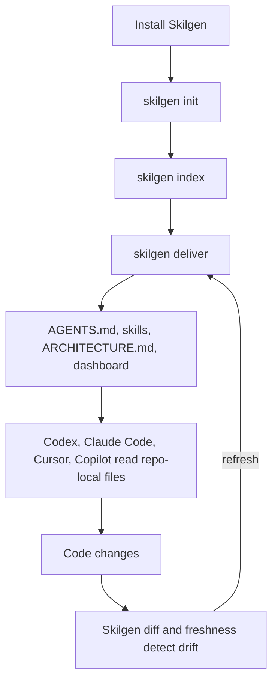

<p align="center">
  
</p>

<h2 align="center">The living skill system for AI coding agents</h2>

<p align="center">
  Every agent session starts from zero. Skilgen ends that.<br/>
  Generate, govern, and keep your codebase's agent knowledge current automatically.
</p>

<p align="center">
  <a href="https://pypi.org/project/skilgen/"></a>
  <a href="https://pypi.org/project/skilgen/"></a>
  <a href="https://github.com/skilgen/skilgen/actions/workflows/ci.yml"></a>
  <a href="docs/examples/README.md"></a>
  <a href="LICENSE"></a>
</p>

---

## Why Skilgen

**vs writing a `CLAUDE.md` by hand**

A hand-written `CLAUDE.md` captures what you remember about your codebase on the day you write it. Skilgen generates repo-local agent context from actual code evidence, requirements inputs, architecture domains, and config signals, then refreshes that context as the code changes. A hand-written file drifts silently. Skilgen gives you generated artifacts, freshness tracking, and a score that tells you when the skill system is no longer trustworthy.

**vs just running Claude, Codex, Cursor, or Copilot**

Every agent session starts from zero. It reads files, infers structure, guesses patterns, and then the session ends. The next session repeats the same exploration. Skilgen captures that understanding once, stores it as versioned repo-local skills and docs grounded in real repository evidence, and makes it available to every session, every tool, and every engineer on the team.

---

## Dashboard

Run `skilgen dashboard` and get a branded HTML surface for score health, architecture domains, evidence graph, dependency signals, freshness, analytics, and agent readiness in one place.

```bash
skilgen dashboard --project-root . --requirements docs/requirements.docx
```

`skilgen deliver --project-root .` already writes `skilgen-dashboard.html` automatically. Use `skilgen dashboard` when you want to regenerate or inspect the dashboard separately from a full delivery run.

Live example bundles generated with Skilgen:
- [Anthropic claude-code dashboard](docs/examples/README.md#anthropic-claude-code)
- [Anthropic claude-agent-sdk-python dashboard](docs/examples/README.md#anthropic-claude-agent-sdk-python)
- [LangChain dashboard](docs/examples/README.md#langchain)
- [LibreChat dashboard + generated skills](docs/examples/README.md#librechat)

The dashboard ships as a self-contained HTML file you can open locally, share with your team, or commit to the repo. No server needed.

### Live Generated Skills

Skilgen does not just draw a dashboard. It materializes a repo-local skill system that agents can load before editing code.

Latest generated example: [anthropics/claude-code](https://github.com/anthropics/claude-code) at `5a7bf28`.

Before = the repo with no generated skill system yet. After = the same repo after `skilgen deliver`.

| View | Without Skilgen | With Skilgen |
| --- | ---: | ---: |
| Repo skill readiness | `19 / 100` | `74 / 100` |
| Grounded reusable skills | `0 / 25` | `23 / 25` |
| Freshness contract | `0 / 25` | `25 / 25` |
| Agent operating structure | `0 / 25` | `19 / 25` |

What got created:
- `8` repo-local skills from the real repo shape.
- `3` materialized top-level domains: `plugins`, `roadmap`, and `scripts`.
- `5` inferred child or subordinate surfaces such as `plugins/hookify` and roadmap phase skills.
- `9` operating artifacts including `AGENTS.md`, `skills/MANIFEST.md`, `skills/GRAPH.md`, `TRACEABILITY.md`, and `skilgen-dashboard.html`.

Inspect the committed examples:
- [Claude Code generated dashboard](docs/examples/claude-code-dashboard.html)
- [Claude Code generated `AGENTS.md`](docs/examples/claude-code-AGENTS.md)
- [Claude Code live `skills/` snapshot](docs/examples/claude-code-skill-tree/skills/MANIFEST.md)

---

## Quick Start

```bash
python -m pip install skilgen
```

```bash
# Export a provider key, or point Skilgen at a private model endpoint below.
export OPENAI_API_KEY="your_key"
# or ANTHROPIC_API_KEY / GOOGLE_API_KEY / GROQ_API_KEY / OPENROUTER_API_KEY
```

```bash
skilgen init --project-root .
skilgen deliver --project-root .
skilgen score --project-root .
```

Current v0.6.0 breadth: `58` CLI entry points spanning delivery, architecture, dashboard, score, diff, analytics, enterprise skills, external skills, MCP connectors, and server APIs.

That single `deliver` run writes:
- `AGENTS.md`
- `ANALYSIS.md`
- `ARCHITECTURE.md`
- `FEATURES.md`
- `REPORT.md`
- `TRACEABILITY.md`
- `skills/**`
- `skilgen-dashboard.html`

From there:

```bash
skilgen architecture --project-root .
skilgen dashboard --project-root .
skilgen diff --project-root .
skilgen analytics --project-root .
skilgen doctor --project-root .
```

If you already have a PRD or architecture file, add `--requirements docs/requirements.docx` to `deliver`, `architecture`, or `dashboard`.

---

## What Skilgen Does

| Capability | What you get |
| --- | --- |
| **Full-corpus indexing** | Every non-excluded file in the repo is indexed with structural or text signals, cached under `.skilgen/corpus/index.json`, and sampled from a 60-file default deep-read budget instead of the old 12-file heuristic. |
| **Evidence graph** | Source snippets, import relationships, runtime hints, documentation signals, and architecture evidence grounded in real repo files. |
| **Living skill tree** | `AGENTS.md`, `skills/**`, `MANIFEST.md`, `GRAPH.md`, and supporting docs generated from evidence and refreshed when the repo changes. |
| **Skilgen Score** | A `0-100` quality bar across Groundedness, Coverage, Freshness, and Structure, with JSON output, history, and SVG badge generation. |
| **Architecture synthesis** | Evidence-backed domain maps with responsibilities, confidence, hotspots, and Mermaid, JSON, or HTML graph exports. |
| **Diff + freshness** | A direct answer to what changed, which domains moved, which skills are stale, and why. |
| **Enterprise BYO model** | Model routing for Azure OpenAI, AWS Bedrock, Ollama, and OpenAI-compatible private gateways, plus public providers. |
| **Enterprise document ingestion** | Requirements and planning inputs from Word, PDF, PowerPoint, Excel, HTML, JSON, YAML, CSV, XML, TOML, INI, and plain-text docs. |
| **MCP governance** | Enterprise skill ingestion, MCP connector policy packs, allowlists, denylists, and approved-connector activation flows. |
| **Analytics** | Usage summaries that show which skills are being loaded, which are hot, and which are ignored. |
| **CI integration** | Score badges, score history, and GitHub Actions examples for quality gating and automated refresh flows. |

---

## Skilgen Score

The quality bar for a skill tree. Four subscores, each worth 25 points:

| Subscore | What it measures |
| --- | --- |
| **Groundedness** | Skills point to real files, check paths, and repo evidence instead of generic advice |
| **Coverage** | Major repo areas are represented in the skill tree |
| **Freshness** | Skills are current relative to recent code changes and saved freshness state |
| **Structure** | `AGENTS.md`, `MANIFEST.md`, `GRAPH.md`, `TRACEABILITY.md`, and cross-links are present and coherent |

```bash
skilgen score --project-root .
skilgen score --project-root . --history
skilgen score --project-root . --badge-file .skilgen/score/badge.svg
```

Example GitHub Actions gating:

```yaml
env:
  SKILGEN_SCORE_THRESHOLD: "75"
```

---

## Corpus Intelligence

Skilgen indexes every non-excluded file in the repo, not just files that happen to match route, service, or model naming patterns. Phase 1 builds a cached structural and text index across the full corpus without using an LLM. Phase 2 uses importance scoring plus cluster-aware sampling to choose the most architecturally significant files for deeper analysis.

```yaml
corpus:
  enabled: true
  budget: 60
  hub_budget: 40
  cluster_budget: 10
  config_budget: 5
  doc_budget: 5
  min_cluster_size: 3
  exclude_generated: true
  exclude_patterns:
    - "vendor/**"
    - "**/*.pb.go"
    - "**/migrations/[0-9]*.py"
```

Treat the sub-budgets as a partition of the top-level `budget` so the sampling plan stays easy to reason about.

Run the indexer standalone:

```bash
skilgen index --project-root .
skilgen deliver --project-root . --skip-index
skilgen architecture --project-root . --skip-index
```

---

## Language Support

Skilgen scans and reasons over **38 source extensions** across modern web, systems, JVM, scripting, and legacy stacks:

| Family | Languages |
| --- | --- |
| **Modern web** | JavaScript, TypeScript, JSX, TSX, Vue, Svelte |
| **Systems** | Python, Go, Rust, C, C++, Zig |
| **JVM** | Java, Kotlin, Scala |
| **Apple / cross-platform** | Swift, Objective-C, Dart |
| **Scripting** | Ruby, PHP, Lua, Elixir, Julia, Bash, PowerShell |
| **Legacy / enterprise** | COBOL (`.cbl`, `.cob`), copybooks (`.cpy`), C# |

Extraction uses Python AST for `.py`, tree-sitter when available for other supported languages, and regex fallback when a parser is unavailable.

---

## Document Ingestion

Skilgen accepts requirements and planning inputs in the formats teams actually use:

`.md` · `.markdown` · `.txt` · `.rst` · `.log` · `.docx` · `.pdf` · `.pptx` · `.xlsx` · `.html` · `.htm` · `.json` · `.yaml` · `.yml` · `.xml` · `.csv` · `.tsv` · `.toml` · `.ini` · `.cfg`

```bash
skilgen deliver --requirements docs/PRD.docx
skilgen deliver --requirements specs/architecture.pdf
skilgen deliver --requirements planning/roadmap.xlsx
```

---

## BYO Model

Phase 1 corpus indexing never touches an LLM. For model-backed synthesis, Skilgen can target private endpoints so the source leaves only the network boundary you choose.

```yaml
# Azure OpenAI
model_provider: azure_openai
model: gpt-4o
model_endpoint: https://your-org.openai.azure.com/
model_extra_kwargs:
  api_version: "2024-05-01-preview"
api_key_env: AZURE_OPENAI_API_KEY
```

```yaml
# AWS Bedrock
model_provider: bedrock
model: anthropic.claude-3-5-sonnet-20241022-v2:0
model_extra_kwargs:
  region: us-east-1
```

```yaml
# Ollama
model_provider: ollama
model: llama3.1:70b
model_endpoint: http://gpu-cluster.internal:11434
```

```yaml
# Any OpenAI-compatible private gateway
model_provider: openai_compatible
model: your-internal-model
model_endpoint: https://ai-gateway.your-org.internal/v1
api_key_env: MODEL_API_KEY
```

Public providers also supported: `openai`, `anthropic`, `gemini`, `google_genai`, `huggingface`, `groq`, and `openrouter`.

---

## Enterprise Governance

```bash
skilgen enterprise ingest --source https://skills.your-org.internal/backend-standards
skilgen skills policy --project-root .
skilgen skills rank --project-root .
```

Skilgen combines repo-native context with enterprise controls:
- private enterprise skill ingestion from paths, Git sources, or URLs
- approved MCP connector policy packs with allowlists, denylists, and OAuth requirements
- traceable connector activation and ranked external skill ecosystems

---

## Generated Outputs

```text
your-repo/
├── AGENTS.md
├── ARCHITECTURE.md
├── FEATURES.md
├── REPORT.md
├── TRACEABILITY.md
├── skilgen-dashboard.html
├── skilgen.yml
├── skills/
│   ├── MANIFEST.md
│   ├── GRAPH.md
│   └── [domain]/
│       ├── SKILL.md
│       └── [subdomain]/SKILL.md
└── .skilgen/
    ├── corpus/index.json
    ├── state/
    └── memory/
```

---

## How It Works


```mermaid
flowchart TD
    A[Install Skilgen] --> B[skilgen init]
    B --> C[skilgen index]
    C --> D[skilgen deliver]
    D --> E[AGENTS.md, skills, ARCHITECTURE.md, dashboard]
    E --> F[Codex, Claude Code, Cursor, Copilot read repo-local files]
    F --> G[Code changes]
    G --> H[Skilgen diff and freshness detect drift]
    H -->|refresh| D
```

1. **Index**: Phase 1 reads every non-excluded file with AST and text extraction. No LLM. Cached.
2. **Synthesize**: Phase 2 deep-reads the most architecturally significant files and builds evidence-backed architecture.
3. **Generate**: Skills, docs, reports, and dashboard outputs are materialized from evidence.
4. **Stay current**: Freshness tracking and diff signals tell you when the skill system has drifted.

---

## Best For

- engineering orgs with multiple teams sharing a codebase
- polyglot repos mixing modern and legacy languages
- enterprises with private model endpoints and data residency requirements
- teams using multiple AI coding tools and wanting one consistent repo-local context layer
- large codebases where agents keep rediscovering the same architecture every session
- repos where a wrong architectural assumption is expensive

---

## Docs

- [`docs/architecture-mode.md`](docs/architecture-mode.md) - architecture synthesis deep dive
- [`docs/evidence-graph.md`](docs/evidence-graph.md) - how evidence is extracted and selected
- [`docs/score.md`](docs/score.md) - Skilgen Score methodology
- [`docs/diff-and-autoupdate.md`](docs/diff-and-autoupdate.md) - freshness and drift detection
- [`docs/enterprise-governance.md`](docs/enterprise-governance.md) - private endpoints, MCP policy, and enterprise skill controls
- [`docs/examples/README.md`](docs/examples/README.md) - generated dashboard examples
- [`RELEASE_NOTES_v0.6.0.md`](RELEASE_NOTES_v0.6.0.md) - what shipped in v0.6.0

## Examples

- [`examples/legacy-cobol/README.md`](examples/legacy-cobol/README.md) - COBOL and copybooks
- [`examples/polyglot-repo/README.md`](examples/polyglot-repo/README.md) - Java, Python, and Go
- [`examples/enterprise-repo/README.md`](examples/enterprise-repo/README.md) - private model endpoints and enterprise skills
- [`examples/github-actions/README.md`](examples/github-actions/README.md) - CI score-gating patterns

---

## Contributing

```bash
python -m pip install -e .
python -m unittest discover -s tests
```

Open a pull request and run the relevant tests before pushing. This repo does not currently ship a separate linter or formatter target, so at minimum run the unit tests and smoke-test the CLI path you changed before opening the PR. See [`CHANGELOG.md`](CHANGELOG.md) for release history.
