# Architecture

## Evidence-backed architecture blueprint for the codebase

Skilgen identified 6 top-level architecture domains from 41 evidence items and 26 domain graph nodes. Parser backends in use: python-ast, regex. Source comprehension currently tracks 1650 symbol-bearing files, 2235 call-bearing files, and 442 mapped tests.

## Visual Overview

```mermaid
graph TD
  api["api"]
  api --> roadmap["roadmap"]
  api -. evidence .-> api_api_app_clients_baseclient_js["api/app/clients/BaseClient.js"]
  api -. evidence .-> api_api_app_clients_ollamaclient_js["api/app/clients/OllamaClient.js"]
  api -. evidence .-> api_api_app_clients_textstream_js["api/app/clients/TextStream.js"]
  client["client"]
  client --> roadmap["roadmap"]
  client -. evidence .-> client_client_src_types_i18next_d_ts["client/src/@types/i18next.d.ts"]
  client -. evidence .-> client_client_src_types_react_d_ts["client/src/@types/react.d.ts"]
  client -. evidence .-> client_client_src_app_jsx["client/src/App.jsx"]
  config["config"]
  config --> roadmap["roadmap"]
  config -. evidence .-> config_config_tests_migrate_prompt_permissions_spec_js["config/__tests__/migrate-prompt-permissions.spec.js"]
  config -. evidence .-> config_config_add_balance_js["config/add-balance.js"]
  config -. evidence .-> config_config_ban_user_js["config/ban-user.js"]
  e2e["e2e"]
  e2e --> roadmap["roadmap"]
  e2e -. evidence .-> e2e_e2e_config_local_example_ts["e2e/config.local.example.ts"]
  e2e -. evidence .-> e2e_e2e_jestsetup_js["e2e/jestSetup.js"]
  e2e -. evidence .-> e2e_e2e_playwright_config_a11y_ts["e2e/playwright.config.a11y.ts"]
  packages["packages"]
  packages --> roadmap["roadmap"]
  packages -. evidence .-> packages_packages_api_rollup_config_js["packages/api/rollup.config.js"]
  packages -. evidence .-> packages_packages_api_src_acl_accesscontrolservice_spec_ts["packages/api/src/acl/accessControlService.spec.ts"]
  packages -. evidence .-> packages_packages_api_src_acl_accesscontrolservice_ts["packages/api/src/acl/accessControlService.ts"]
  roadmap["roadmap"]
  roadmap --> requirements["requirements"]
  roadmap --> backend["backend"]
  roadmap --> frontend["frontend"]
  roadmap -. evidence .-> roadmap_skills_roadmap_skill_md["skills/roadmap/SKILL.md"]
  roadmap -. evidence .-> roadmap_report_md["REPORT.md"]
  api --> skills_api_skill_md["skills/api/SKILL.md"]
  skills_api_skill_md --> skills_api_app_skill_md["skills/api/app/SKILL.md"]
  skills_api_skill_md --> skills_api_cache_skill_md["skills/api/cache/SKILL.md"]
  skills_api_skill_md --> skills_api_config_skill_md["skills/api/config/SKILL.md"]
  skills_api_skill_md --> skills_api_db_skill_md["skills/api/db/SKILL.md"]
  skills_api_skill_md --> skills_api_server_skill_md["skills/api/server/SKILL.md"]
  skills_api_skill_md -. cross-link .-> skills_roadmap_skill_md["skills/roadmap/SKILL.md"]
  client --> skills_client_skill_md["skills/client/SKILL.md"]
  skills_client_skill_md --> skills_client_src_skill_md["skills/client/src/SKILL.md"]
  skills_client_skill_md -. cross-link .-> skills_roadmap_skill_md["skills/roadmap/SKILL.md"]
  config --> skills_config_skill_md["skills/config/SKILL.md"]
  skills_config_skill_md --> skills_config_translations_skill_md["skills/config/translations/SKILL.md"]
  skills_config_skill_md -. cross-link .-> skills_roadmap_skill_md["skills/roadmap/SKILL.md"]
  e2e --> skills_e2e_skill_md["skills/e2e/SKILL.md"]
  skills_e2e_skill_md --> skills_e2e_setup_skill_md["skills/e2e/setup/SKILL.md"]
  skills_e2e_skill_md --> skills_e2e_specs_skill_md["skills/e2e/specs/SKILL.md"]
  skills_e2e_skill_md -. cross-link .-> skills_roadmap_skill_md["skills/roadmap/SKILL.md"]
  packages --> skills_packages_skill_md["skills/packages/SKILL.md"]
  skills_packages_skill_md --> skills_packages_api_skill_md["skills/packages/api/SKILL.md"]
  skills_packages_skill_md --> skills_packages_client_skill_md["skills/packages/client/SKILL.md"]
  skills_packages_skill_md --> skills_packages_data_provider_skill_md["skills/packages/data-provider/SKILL.md"]
  skills_packages_skill_md --> skills_packages_data_schemas_skill_md["skills/packages/data-schemas/SKILL.md"]
  skills_packages_skill_md -. cross-link .-> skills_roadmap_skill_md["skills/roadmap/SKILL.md"]
  roadmap --> skills_roadmap_skill_md["skills/roadmap/SKILL.md"]
  skills_roadmap_skill_md --> skills_roadmap_phase_0_skill_md["skills/roadmap/phase-0/SKILL.md"]
  skills_roadmap_skill_md --> skills_roadmap_phase_1_skill_md["skills/roadmap/phase-1/SKILL.md"]
  skills_roadmap_skill_md --> skills_roadmap_phase_2_skill_md["skills/roadmap/phase-2/SKILL.md"]
  skills_roadmap_skill_md --> skills_roadmap_phase_3_skill_md["skills/roadmap/phase-3/SKILL.md"]
  api_app_clients_baseclient_js["api/app/clients/BaseClient.js"]
  api_app_clients_baseclient_js --> api_app_clients_baseclient_js_function_to["function to"]
  api_app_clients_baseclient_js --> api_app_clients_baseclient_js_function_constructs["function constructs"]
  api_app_clients_ollamaclient_js["api/app/clients/OllamaClient.js"]
  api_app_clients_ollamaclient_js --> api_app_clients_ollamaclient_js_class_ollamaclient["class OllamaClient"]
  api_app_clients_ollamaclient_js --> api_app_clients_ollamaclient_js_ollamaclient["OllamaClient"]
  api_app_clients_textstream_js["api/app/clients/TextStream.js"]
  api_app_clients_textstream_js --> api_app_clients_textstream_js_class_textstream["class TextStream"]
  api_app_clients_textstream_js --> api_app_clients_textstream_js_textstream["TextStream"]
  api_app_clients_prompts_artifacts_js["api/app/clients/prompts/artifacts.js"]
  api_app_clients_prompts_artifacts_js --> api_app_clients_prompts_artifacts_js_function_counter["function Counter"]
  api_app_clients_prompts_artifacts_js --> api_app_clients_prompts_artifacts_js_counter["Counter"]
  api_app_clients_prompts_createcontexthandlers_js["api/app/clients/prompts/createContextHandlers.js"]
  api_app_clients_prompts_createcontexthandlers_js --> api_app_clients_prompts_createcontexthandlers_js_function_createcontexthandlers["function createContextHandlers"]
  api_app_clients_prompts_createcontexthandlers_js --> api_app_clients_prompts_createcontexthandlers_js_createcontexthandlers["createContextHandlers"]
  api_app_clients_prompts_formatgoogleinputs_js["api/app/clients/prompts/formatGoogleInputs.js"]
  api_app_clients_prompts_formatgoogleinputs_js --> api_app_clients_prompts_formatgoogleinputs_js_function_formatgoogleinputs["function formatGoogleInputs"]
  api_app_clients_prompts_formatgoogleinputs_js --> api_app_clients_prompts_formatgoogleinputs_js_formatgoogleinputs["formatGoogleInputs"]
```

## Dominant Languages
- `typescript`
- `typescript-react`
- `javascript`

## Source Comprehension
- Symbol graph files: `1650`
- Call graph files: `2235`
- Config/runtime files: `123`
- Tests mapped to code: `442`

## Parser Backends
- `python-ast`: `1` files
- `regex`: `2476` files

### Example Symbol Surfaces
- `api/app/clients/BaseClient.js`: `function to`, `function constructs`, `class BaseClient`, `class implementation`
- `api/app/clients/OllamaClient.js`: `class OllamaClient`, `OllamaClient`
- `api/app/clients/TextStream.js`: `class TextStream`, `TextStream`
- `api/app/clients/prompts/artifacts.js`: `function Counter`, `Counter`, `can`, `will`
- `api/app/clients/prompts/createContextHandlers.js`: `function createContextHandlers`, `createContextHandlers`
- `api/app/clients/prompts/formatGoogleInputs.js`: `function formatGoogleInputs`, `formatGoogleInputs`
- `api/app/clients/prompts/shadcn-docs/components.js`: `function ToastDemo`, `ToastDemo`
- `api/app/clients/prompts/shadcn-docs/generate.js`: `function generateShadcnPrompt`, `generateShadcnPrompt`

### Example Config And Runtime Signals
- `.devcontainer/Dockerfile`: `env:FROM`, `env:RUN`, `env:WORKDIR`
- `.devcontainer/devcontainer.json`: `runtime:docker`
- `.devcontainer/docker-compose.yml`: `env:HOST`, `env:MEILI_HOST`, `env:MEILI_MASTER_KEY`, `env:MEILI_NO_ANALYTICS`, `env:MONGO_URI`
- `.do/gitnexus/Dockerfile`: `env:ARG`, `env:COPY`, `env:ENTRYPOINT`, `env:EXPOSE`, `env:EXTENSION`
- `.do/gitnexus/docker-compose.yml`: `env:API_TOKEN`, `env:CMD`, `env:GITNEXUS_DOMAIN`, `env:GITNEXUS_IMAGE`, `env:OOM`
- `.env.example`: `env:AGENT_DEBUG_LOGGING`, `env:ALLOW_ACCOUNT_DELETION`, `env:ALLOW_EMAIL_LOGIN`, `env:ALLOW_PASSWORD_RESET`, `env:ALLOW_REGISTRATION`
- `.github/FUNDING.yml`: `env:LFX`
- `.github/ISSUE_TEMPLATE/BUG-REPORT.yml`: `env:CODE_OF_CONDUCT`, `env:HEAD`, `env:YYYY`, `runtime:docker`

### Example Test Mapping
- `api/app/clients/prompts/formatAgentMessages.spec.js` -> `api/app/clients/prompts/artifacts.js`, `api/app/clients/prompts/createContextHandlers.js`, `api/app/clients/prompts/createVisionPrompt.js`, `api/app/clients/prompts/formatGoogleInputs.js`
- `api/app/clients/prompts/formatGoogleInputs.spec.js` -> `api/app/clients/prompts/formatGoogleInputs.js`, `api/app/clients/prompts/artifacts.js`, `api/app/clients/prompts/createContextHandlers.js`, `api/app/clients/prompts/createVisionPrompt.js`
- `api/app/clients/prompts/formatMessages.spec.js` -> `api/app/clients/prompts/formatMessages.js`, `api/app/clients/prompts/artifacts.js`, `api/app/clients/prompts/createContextHandlers.js`, `api/app/clients/prompts/createVisionPrompt.js`
- `api/app/clients/specs/BaseClient.test.js` -> `api/app/clients/BaseClient.js`, `api/app/clients/specs/FakeClient.js`, `packages/data-provider/specs/openapiSpecs.ts`, `packages/data-schemas/src/app/specs.ts`
- `api/app/clients/tools/structured/specs/DALLE3-proxy.spec.js` -> `api/app/clients/specs/FakeClient.js`, `api/app/clients/tools/structured/DALLE3.js`, `packages/data-provider/specs/openapiSpecs.ts`, `packages/data-schemas/src/app/specs.ts`
- `api/app/clients/tools/structured/specs/DALLE3.spec.js` -> `api/app/clients/specs/FakeClient.js`, `api/app/clients/tools/structured/DALLE3.js`, `packages/data-provider/specs/openapiSpecs.ts`, `packages/data-schemas/src/app/specs.ts`
- `api/app/clients/tools/structured/specs/GeminiImageGen-proxy.spec.js` -> `api/app/clients/specs/FakeClient.js`, `api/app/clients/tools/structured/GeminiImageGen.js`, `packages/data-provider/specs/openapiSpecs.ts`, `packages/data-schemas/src/app/specs.ts`
- `api/app/clients/tools/structured/specs/GoogleSearch.spec.js` -> `api/app/clients/specs/FakeClient.js`, `api/app/clients/tools/structured/GoogleSearch.js`, `packages/data-provider/specs/openapiSpecs.ts`, `packages/data-schemas/src/app/specs.ts`

## Skill Materialization Plan
### api
- Decision: `split`
- Parent skill: `skills/api/SKILL.md`
- Child skills:
  - `skills/api/app/SKILL.md`
  - `skills/api/cache/SKILL.md`
  - `skills/api/config/SKILL.md`
  - `skills/api/db/SKILL.md`
  - `skills/api/server/SKILL.md`
  - `skills/api/strategies/SKILL.md`
- Cross-links:
  - `skills/roadmap/SKILL.md`
- Rationale: Split because 8 concrete child skill surfaces emerged from 6 grounded evidence paths. The parent skill can hold shared context while child skills isolate the distinct capability seams around api-app, api-cache, api-config.

### client
- Decision: `keep`
- Parent skill: `skills/client/SKILL.md`
- Child skills:
  - `skills/client/src/SKILL.md`
- Cross-links:
  - `skills/roadmap/SKILL.md`
- Rationale: Keep as a first-class boundary because confidence is 0.87, 6 evidence paths cluster around one coherent responsibility set, and the boundary is clearer as a single skill than as shallower splits.

### config
- Decision: `keep`
- Parent skill: `skills/config/SKILL.md`
- Child skills:
  - `skills/config/translations/SKILL.md`
- Cross-links:
  - `skills/roadmap/SKILL.md`
- Rationale: Keep as a first-class boundary because confidence is 0.87, 6 evidence paths cluster around one coherent responsibility set, and the boundary is clearer as a single skill than as shallower splits.

### e2e
- Decision: `split`
- Parent skill: `skills/e2e/SKILL.md`
- Child skills:
  - `skills/e2e/setup/SKILL.md`
  - `skills/e2e/specs/SKILL.md`
- Cross-links:
  - `skills/roadmap/SKILL.md`
- Rationale: Split because 2 concrete child skill surfaces emerged from 6 grounded evidence paths. The parent skill can hold shared context while child skills isolate the distinct capability seams around e2e-setup, e2e-specs.

### packages
- Decision: `split`
- Parent skill: `skills/packages/SKILL.md`
- Child skills:
  - `skills/packages/api/SKILL.md`
  - `skills/packages/client/SKILL.md`
  - `skills/packages/data-provider/SKILL.md`
  - `skills/packages/data-schemas/SKILL.md`
- Cross-links:
  - `skills/roadmap/SKILL.md`
- Rationale: Split because 4 concrete child skill surfaces emerged from 6 grounded evidence paths. The parent skill can hold shared context while child skills isolate the distinct capability seams around packages-api, packages-client, packages-data-provider.

### roadmap
- Decision: `split`
- Parent skill: `skills/roadmap/SKILL.md`
- Child skills:
  - `skills/roadmap/phase-0/SKILL.md`
  - `skills/roadmap/phase-1/SKILL.md`
  - `skills/roadmap/phase-2/SKILL.md`
  - `skills/roadmap/phase-3/SKILL.md`
- Rationale: Split because 4 concrete child skill surfaces emerged from 2 grounded evidence paths. The parent skill can hold shared context while child skills isolate the distinct capability seams around roadmap-phase-0, roadmap-phase-1, roadmap-phase-2.

## Architecture Domains
### api
- Confidence: `0.87`
- Summary: Backend application guidance for API routes, services, persistence, auth, and runtime orchestration under the repo's `api/` surface.
- Responsibilities:
  - Backend application guidance for API routes, services, persistence, auth, and runtime orchestration under the repo's `api/` surface.
  - repo-native app surface
  - top-level implementation boundary
- Evidence paths:
  - `api/app/clients/BaseClient.js`
  - `api/app/clients/OllamaClient.js`
  - `api/app/clients/TextStream.js`
  - `api/app/clients/index.js`
  - `api/app/clients/prompts/artifacts.js`
  - `api/app/clients/prompts/createContextHandlers.js`
- Related domains: `roadmap`
- Recommended skill path: `skills/api/SKILL.md`

### client
- Confidence: `0.87`
- Summary: Frontend application guidance for the user-facing client, routes, UI composition, and client-side runtime behavior.
- Responsibilities:
  - Frontend application guidance for the user-facing client, routes, UI composition, and client-side runtime behavior.
  - repo-native app surface
  - top-level implementation boundary
- Evidence paths:
  - `client/src/@types/i18next.d.ts`
  - `client/src/@types/react.d.ts`
  - `client/src/App.jsx`
  - `client/src/Providers/ActivePanelContext.tsx`
  - `client/src/Providers/AddedChatContext.tsx`
  - `client/src/Providers/AgentPanelContext.tsx`
- Related domains: `roadmap`
- Recommended skill path: `skills/client/SKILL.md`

### config
- Confidence: `0.87`
- Summary: Configuration guidance for runtime configuration, feature flags, translation setup, and environment-driven behavior.
- Responsibilities:
  - Configuration guidance for runtime configuration, feature flags, translation setup, and environment-driven behavior.
  - repo-native app surface
  - top-level implementation boundary
- Evidence paths:
  - `config/__tests__/migrate-prompt-permissions.spec.js`
  - `config/add-balance.js`
  - `config/ban-user.js`
  - `config/connect.js`
  - `config/create-user.js`
  - `config/delete-banner.js`
- Related domains: `roadmap`
- Recommended skill path: `skills/config/SKILL.md`

### e2e
- Confidence: `0.87`
- Summary: End-to-end testing guidance for browser workflows, setup, and cross-surface regression coverage.
- Responsibilities:
  - End-to-end testing guidance for browser workflows, setup, and cross-surface regression coverage.
  - repo-native app surface
  - top-level implementation boundary
- Evidence paths:
  - `e2e/config.local.example.ts`
  - `e2e/jestSetup.js`
  - `e2e/playwright.config.a11y.ts`
  - `e2e/playwright.config.local.ts`
  - `e2e/playwright.config.ts`
  - `e2e/setup/authenticate.ts`
- Related domains: `roadmap`
- Recommended skill path: `skills/e2e/SKILL.md`

### packages
- Confidence: `0.87`
- Summary: Shared package guidance for reusable internal packages that support the app runtime and product surfaces.
- Responsibilities:
  - Shared package guidance for reusable internal packages that support the app runtime and product surfaces.
  - repo-native app surface
  - top-level implementation boundary
- Evidence paths:
  - `packages/api/rollup.config.js`
  - `packages/api/src/acl/accessControlService.spec.ts`
  - `packages/api/src/acl/accessControlService.ts`
  - `packages/api/src/admin/config.handler.spec.ts`
  - `packages/api/src/admin/config.spec.ts`
  - `packages/api/src/admin/config.ts`
- Related domains: `roadmap`
- Recommended skill path: `skills/packages/SKILL.md`

### roadmap
- Confidence: `0.84`
- Summary: Delivery sequencing domain that keeps phases, next steps, and implementation order explicit for agents.
- Responsibilities:
  - Delivery sequencing domain that keeps phases, next steps, and implementation order explicit for agents.
  - Coordinates subdomains: roadmap-phase-0, roadmap-phase-1, roadmap-phase-2, roadmap-phase-3.
  - phase-based delivery
  - sequenced implementation planning
- Evidence paths:
  - `skills/roadmap/SKILL.md`
  - `REPORT.md`
- Related domains: `requirements`, `backend`, `frontend`
- Recommended skill path: `skills/roadmap/SKILL.md`

## Evidence Graph Recommendations
- Use high-signal source evidence to define domain boundaries before generating skills.
- Prefer domains that are supported by both code evidence and requirements intent.
- Optimize skill synthesis around the dominant languages: typescript, typescript-react, javascript.
- Use structural evidence such as functions, classes, divisions, and sections to refine skill boundaries.
- Use the symbol graph to align skill boundaries with real modules, classes, and callable surfaces.
- Parser backends in use: python-ast, regex.
- Keep skill guidance grounded in both implementation evidence and the nearest mapped tests.

## Hotspots
- Dominant languages: typescript, typescript-react, javascript.
